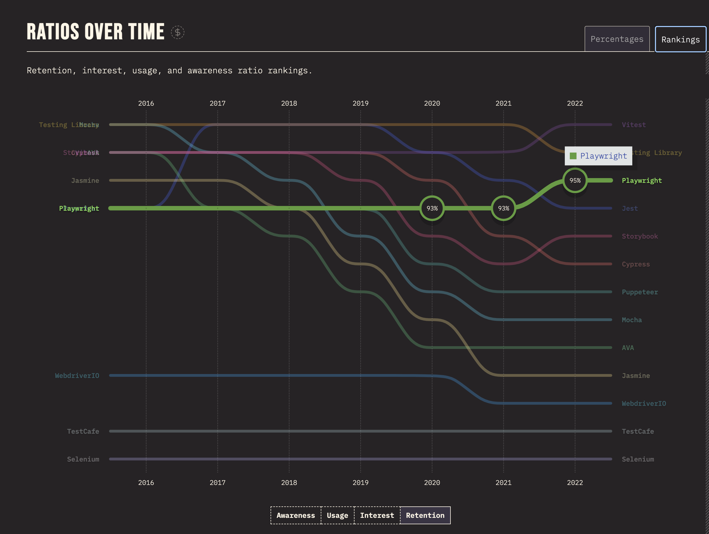

## 1.3 What is Playwright?

[Playwright](https://playwright.dev/) is an open-source framework for _reliable_ end-to-end testing for modern web apps. It is relatively new (released in 2020) but maintains an active [release schedule](https://playwright.dev/docs/release-notes#version-138), adding new features and fixing bugs at a rapid pace. 

Playwright support multiple languages - meaning that you can write tests in JavaScript, TypeScript, Python, Java or C#. This workshop will focus on JavaScript, but the concepts should be applicable to other languages as well.

🎭🛑 | Add figure with 4 language logos - and mention that this is multi-language.

The [2022 StateOfJS](https://2022.stateofjs.com/en-US/libraries/testing/) trends on testing show that Playwright is growing steadily in popularity and retention within the web development community. 

The open-source framework has gained over 50K stars in less than 4 years, and continues to [release new features and fixes](https://aka.ms/playwright/youtube) on a monthly basis, helping catch up in parity with other test automation frameworks.
