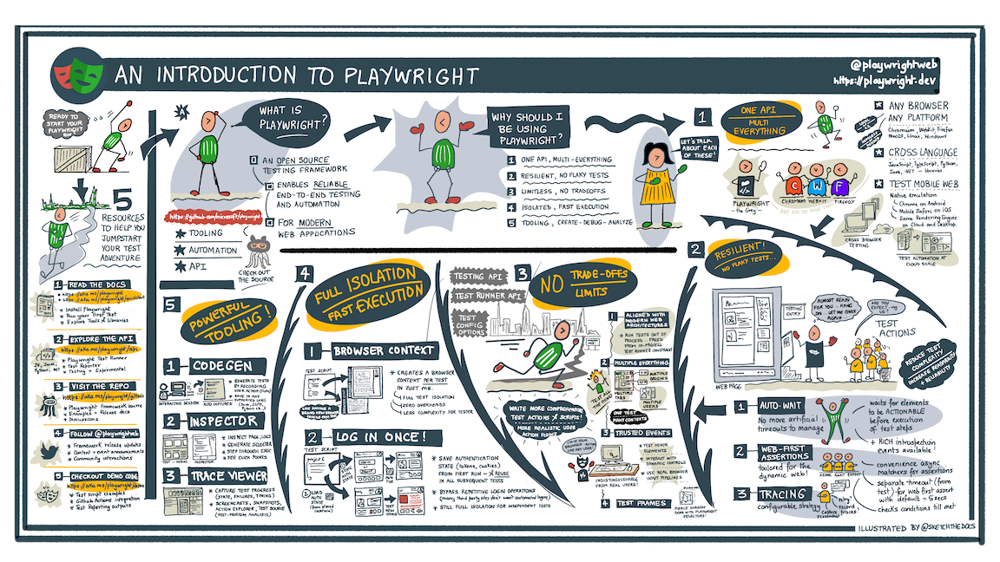

## Why use Playwright?

There are [many reasons for choosing Playwright](https://playwright.dev/docs/why-playwright) as your test automation framework. Here are four key ones:
 1. _Unified API_. Playwright works across all modern browser engines (Chromium, WebKit, Firefox) and supports device emulation for mobile coverage. It has headed and headless browser options, allowing developers to prioritize between debugging convenience and CI/Cloud execution.
 1. _Resilient Testing_. Playwright implements "auto-wait" (no artificial timeouts) and "auto-retry" (web assertions) - eliminating key causes for flaky tests. Rich tooling options (tracing, time-travel) make it easy to debug and fix issues if failures occur.
 1. _Test Isolation_. Every test runs in its own _BrowserContext_, independent of other tests running at the same time. Tests are run in parallel (for optimization) and one test failure will not impact others (for reliability).
 1. _Powerful Tooling_. Playwright streamlines the developer experience from test authoring, to execution, debugging, reporting, and profiling - with options to use a CLI or the Visual Studio Code extension.

