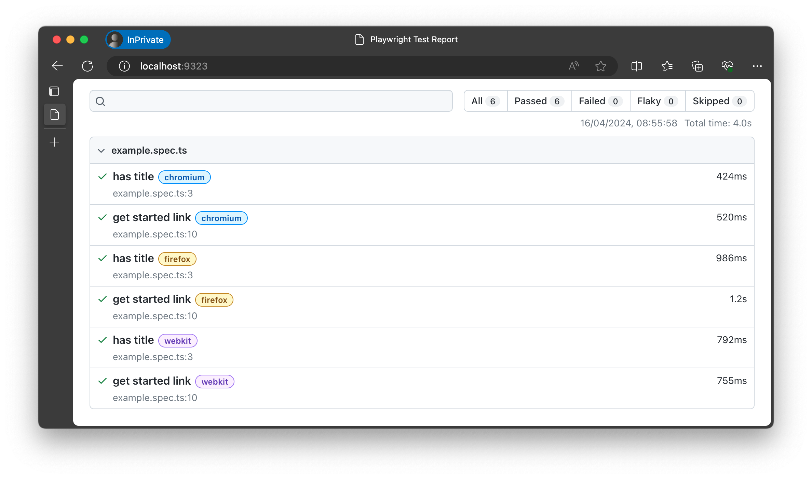
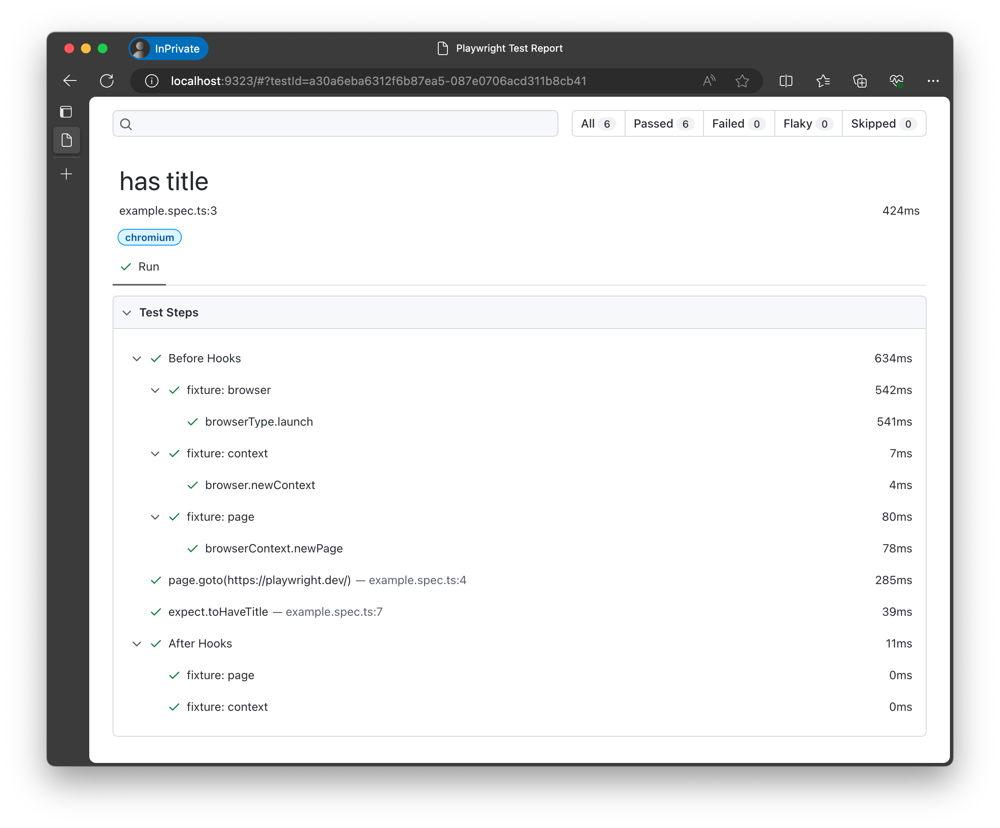

# Exercise: Understand Setup

In this unit, we'll install Playwright, explore what got installed and validate that we can run the example tests that come when installing Playwright.

Let's get started.

## Step 1: Install Playwright

Start by opening the terminal and creating a new directory for your project. Playwright can also be installed in an existing project but for this workshop we will create a new one. Let's call it `learn-playwright`. 

```bash
mkdir learn-playwright
```

Let's navigate into the new directory:

```bash
cd learn-playwright
```

In this new empty directory let's install Playwright and explore what got installed.

```bash
npm init playwright@latest
```
When you run this command you will be asked a few questions to configure the Playwright project:
  - Select the language you want to use for your tests. We recommend TypeScript
  - Select the name of the test directory. We recommend `tests`
  - Add a GitHub Action for automating tests. We recommend `Yes`
  - Install Playwright browsers. We recommend selecting the default of `true`.
  
You should now see the following output in the terminal:

```js
Initializing NPM project (npm init -y)…
Wrote to /learn-playwright/package.json:

{
  "name": "learn-playwright",
  "version": "1.0.0",
  "description": "",
  "main": "index.js",
  "scripts": {
    "test": "echo \"Error: no test specified\" && exit 1"
  },
  "keywords": [],
  "author": "",
  "license": "ISC"
}

Installing Playwright Test (npm install --save-dev @playwright/test)…

added 4 packages, and audited 5 packages in 2s

found 0 vulnerabilities
Installing Types (npm install --save-dev @types/node)…

added 2 packages, and audited 7 packages in 580ms

found 0 vulnerabilities
Writing playwright.config.ts.
Writing .github/workflows/playwright.yml.
Writing tests/example.spec.ts.
Writing tests-examples/demo-todo-app.spec.ts.
Writing package.json.
Downloading browsers (npx playwright install)…
✔ Success! Created a Playwright Test project at /learn-playwright

Inside that directory, you can run several commands:

  npx playwright test
    Runs the end-to-end tests.

  npx playwright test --ui
    Starts the interactive UI mode.

  npx playwright test --project=chromium
    Runs the tests only on Desktop Chrome.

  npx playwright test example
    Runs the tests in a specific file.

  npx playwright test --debug
    Runs the tests in debug mode.

  npx playwright codegen
    Auto generate tests with Codegen.

We suggest that you begin by typing:

    npx playwright test

And check out the following files:
  - ./tests/example.spec.ts - Example end-to-end test
  - ./tests-examples/demo-todo-app.spec.ts - Demo Todo App end-to-end tests
  - ./playwright.config.ts - Playwright Test configuration

Visit https://playwright.dev/docs/intro for more information. ✨

Happy hacking! 🎭
```

This tells us that a new NPM project has been created with a `package.json` file, and that Playwright Test has been installed. It also tells which files have been created for us:

 1. `playwright.config.ts` - the Playwright Test Configuration file.
 2. `.github/workflows/playwright.yml` - GitHub Action for automating tests
 3. `tests/` - top-level folder that Playwright searches recursively for tests with an example test script.
 4. `tests-examples/` - staging folder with a demo todo app test script to try out.
 5. `package.json` - the NPM project file.

Next it tells us that Playwright is downloading browsers. Playwright will download the latest version of the browsers that we can use to run our tests on. It uses browser binaries that are installed locally, so you don't need to have the browsers installed on your machine. 

Once finished we get a success message and a list of commands we can run to interact with the Playwright Test project.


## Step 4: Validate Playwright Test Runner

To run tests in Playwright we use the `npx playwright test` command. This command will run all the tests in the `tests/` folder, which is the folder name we defined in step 2 when installing.

```bash
npx playwright test
```

When we run the command you will see the following output:

```bash
Running 6 tests using 5 workers
  6 passed (4.0s)

To open last HTML report run:

  npx playwright show-report
```

This tells us that 6 tests were run using 5 workers. By default Playwright runs tests in parallel. To do this it uses workers. The number of workers is determined by the number of CPU cores available. Playwright will use half of the available CPU cores. 

Let's open the HTML report to see more details about the test run.

```bash
npx playwright show-report
```

We should then get the following message telling us the report is being served locally and a browser window will open with the report.

```bash
Serving HTML report at http://localhost:9323. Press Ctrl+C to quit.
```



The report gives us the following insights:
 - We have 2 test cases ("has title", "get started link")
 - We ran each across 3 browser engines (chromium, firefox, webkit)
 - The test cases were defined in the `example.spec.ts` file
 - The test run took _4.0s_ with all 6 tests passing (none skipped)

Clicking on a particular row gives you the detailed run of that test case. For example if we click on the first one, we get the following details:

 - The test is called "has title"
 - The file name is `example.spec.ts` and the line number is `3`
 - This test case was run on Chromium
 - The "Before Hooks" ran first. This launches the browser and sets the browser and page _context_ (fixtures) for test isolation.
 - The Test "Action" on line 4 ran next. This resulted in a _navigation_ to a specific page.
 - Then the Test "Assertion" on line 7 executes. This _validates_ that the page has a specific title.
 - The "After Hooks" run last. They take any context _cleanup_ actions needed. 
 - This test case took "424 ms" to complete.



To run our test only on the Chromium browser we can use the `--project` option.

```bash
npx playwright test --project chromium
```

Go ahead and run the command. You will now see that 2 tests were run using 2 workers and if you open the report you will see that the tests were only run on the Chromium browser.

🚀 | Congratulations we have successfully installed Playwright and run the example test. In the next section we shall take a look at the test in more detail as well as the Playwright configuration file.
