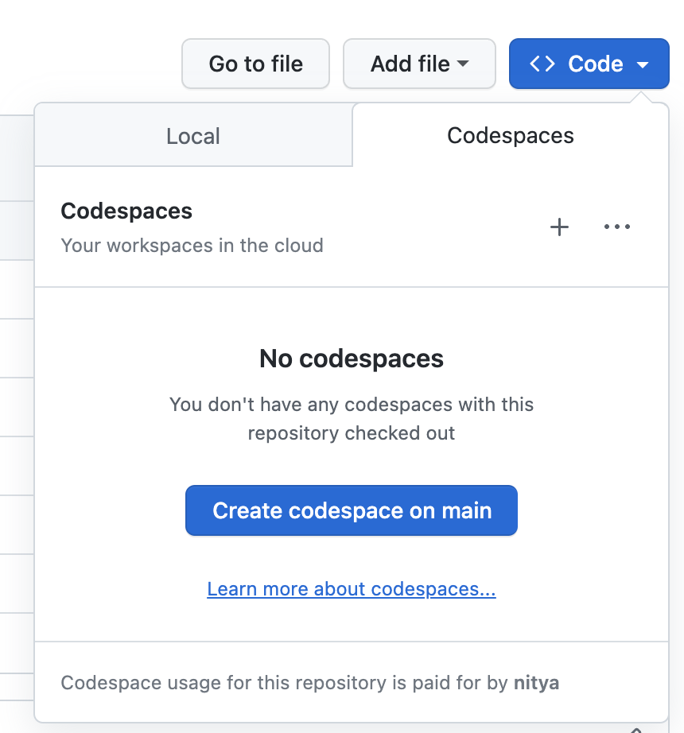
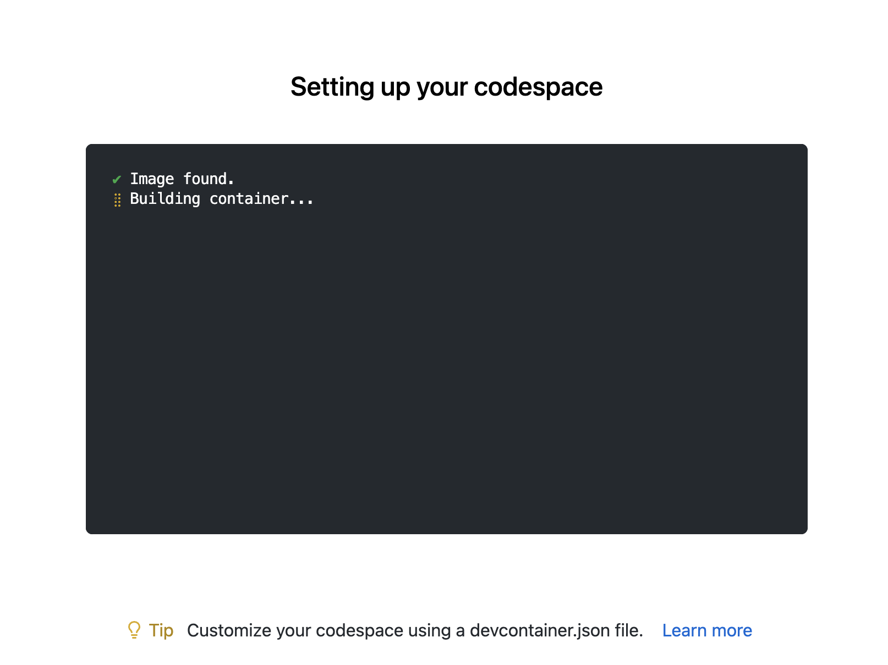

## 2.2 Launch GitHub Codespaces

You will notice the the repository has a `.devcontainer/devcontainer.json` file. This shows that it can be run in a [development container](https://containers.dev) - a pre-configured environment (based on a Docker container image) that has all the necessary tools and libraries installed for you. You can run the container in the cloud (with GitHub Codespaces) or run it in your local device (with Docker Desktop). We'll use the first option.

> Click the `Code` tab on your fork of the repo, as shown below. 

> Click `Create codespace on main`. 

You should see a new tab open with a message like the one shown below. This indicates the container is being built. Once ready, the tab transforms into a _Visual Studio Code Editor UI_ in the browser. 

Congratulations - you are now running in a GitHub Codespace. There is a generous free quota that is sufficient for this purpose. Want to learn more about how this works, and how you can optimize your free usage? Check out these references:

- [GitHub Codespaces Overview](https://docs.github.com/en/codespaces/overview)
- [View Your GitHub Codespaces Usage](https://docs.github.com/en/billing/managing-billing-for-github-codespaces/viewing-your-github-codespaces-usage)
- [Manage Spending Limits for GitHub Codespaces](https://docs.github.com/en/billing/managing-billing-for-github-codespaces/managing-the-spending-limit-for-github-codespaces)

🚀 | You are now ready to validate the sample application.
