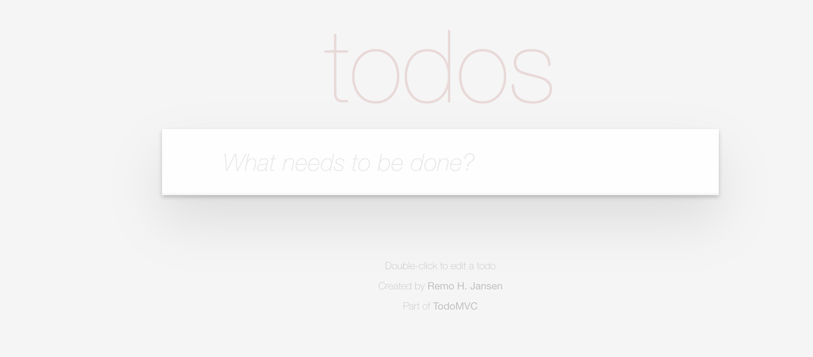

## 2.3 Validate The Sample App

The repository comes with a [sample application](./app-todomvc/) that we'll be testing. Before we get started, let's make sure the application runs as expected.

1. Change to the application directory
```bash
cd app-todomvc
```

2. Use a recent Node.js version (for example LTS). You can check your node version for example by running:
```bash
node --version
```    
You should see something like this: 

```bash

Now using node v18.18.0 (npm v9.8.1)
```

1. Follow instructions to build and run app
```bash
npm run build
npm run start
```
After running the above commands you should now see a message in the terminal telling you that the app has started and is being served.
```bash
> start
> node ./serve.js

Serving on http://localhost:4200/
```


### 2.3.1 Using Codespaces 
You should see a pop-up like this in your Visual Studio Code environment. This tells you that GitHub Codespaces is _automatically forwarding that port to your host device_ allowing the server on that port to be accessed from your device browser (outside the GitHub Codespaces dev container). See: [forwarding ports in your codespace](https://docs.github.com/en/codespaces/developing-in-codespaces/forwarding-ports-in-your-codespace) for more information.


You can now click "Open in Browser" to preview the application in your host device. You should see something like this:



### 2.3.2 Using Local Development

🎭| TODO


### 2.3.3 About ToDoMVC

The sample application is an _adapted version_ of the [tastejs/todomvc](https://github.com/tastejs/todomvc) reference application set. More specifically, it is derived from the [TypeScript & React](https://todomvc.com/examples/typescript-react/#/) version of the application whose [source is available here](https://github.com/tastejs/todomvc/tree/gh-pages/examples/typescript-react).

The Playwright team maintains a [hosted version](https://demo.playwright.dev/todomvc) of this application that has been adapted to support the `demo-todo-app.spec.ts` sample specification that ships with every new Playwright project. We are using _that_ version of the ToDoMVC app so we can deconstruct this demo sample to learn key concepts.

🚀 | Congratulations!! You can now validate the Playwright setup.