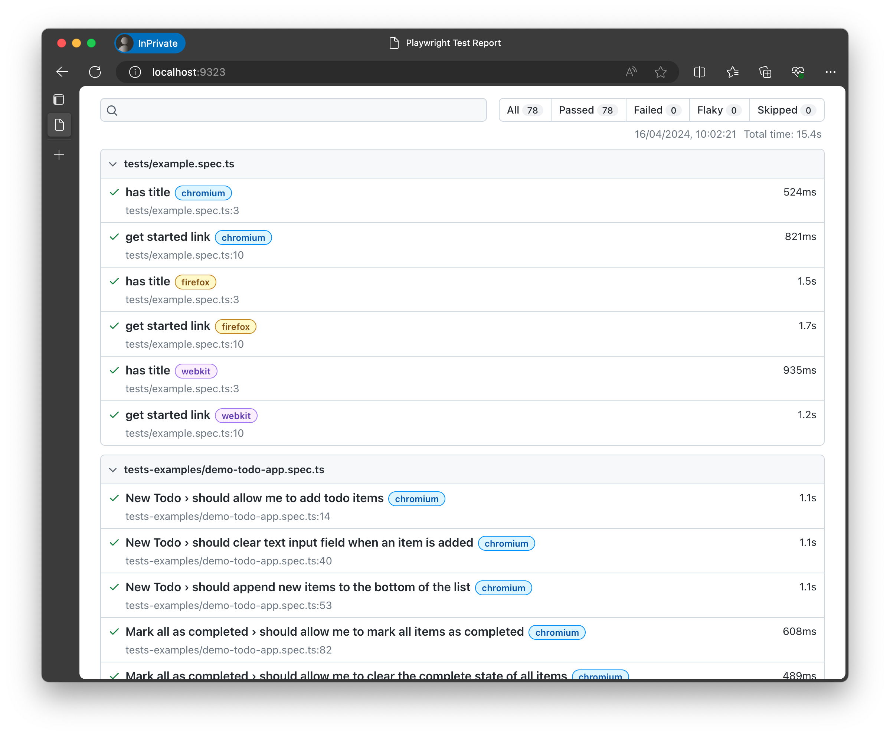
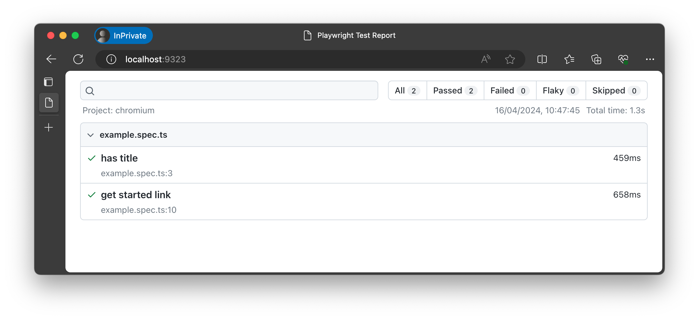
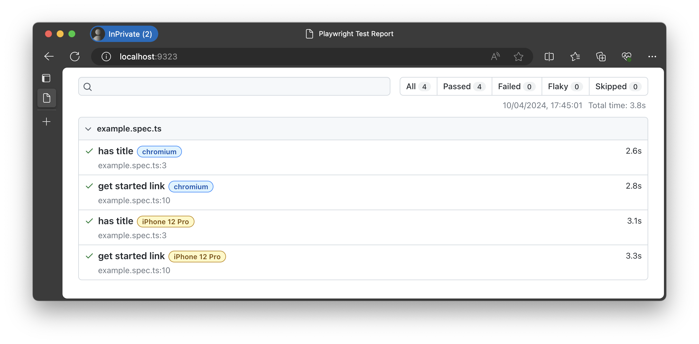
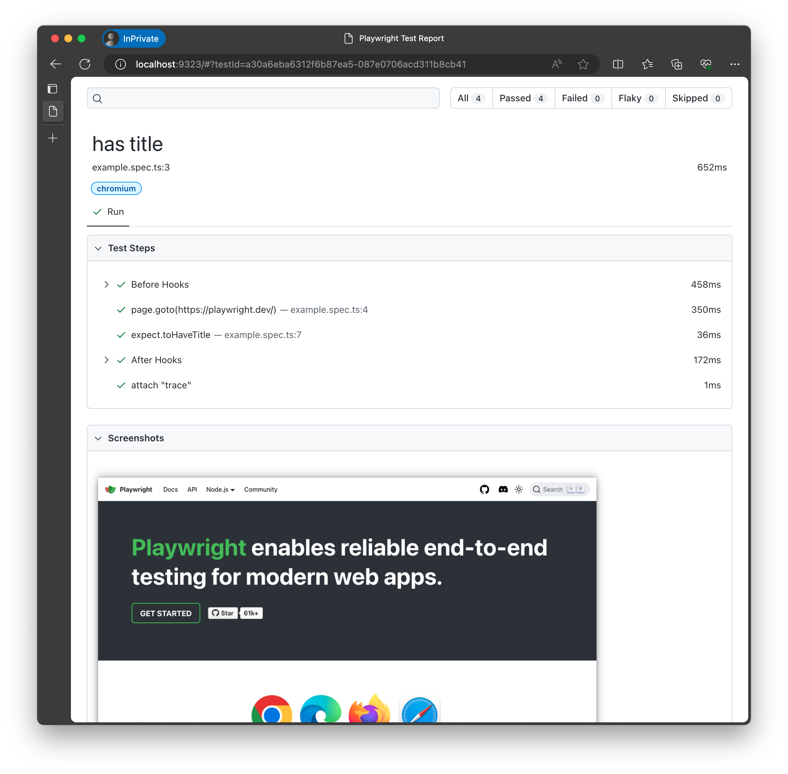
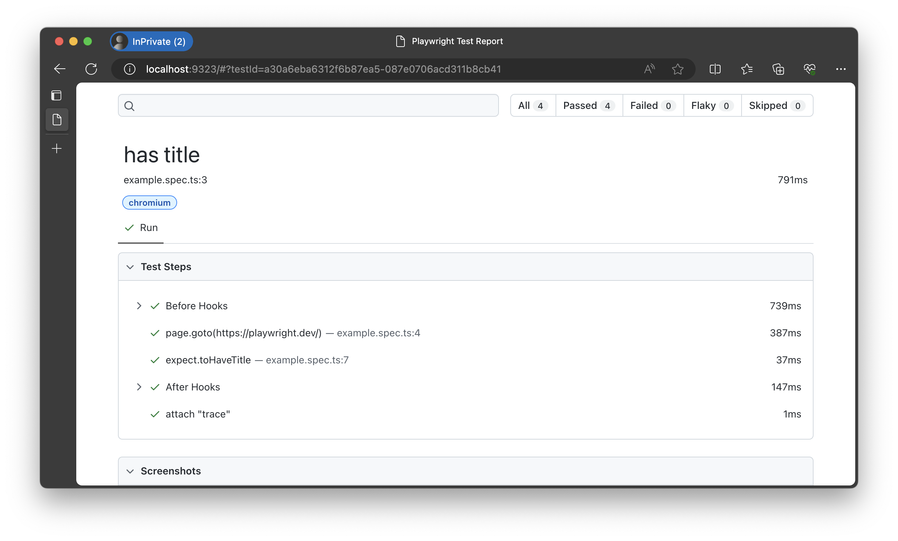
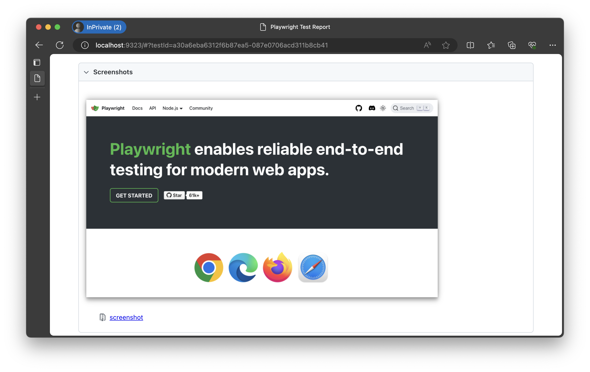
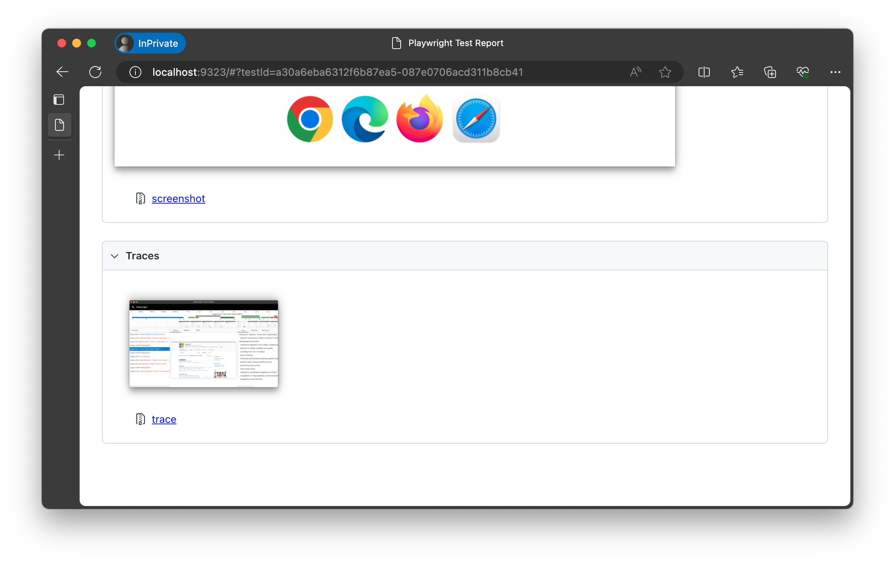
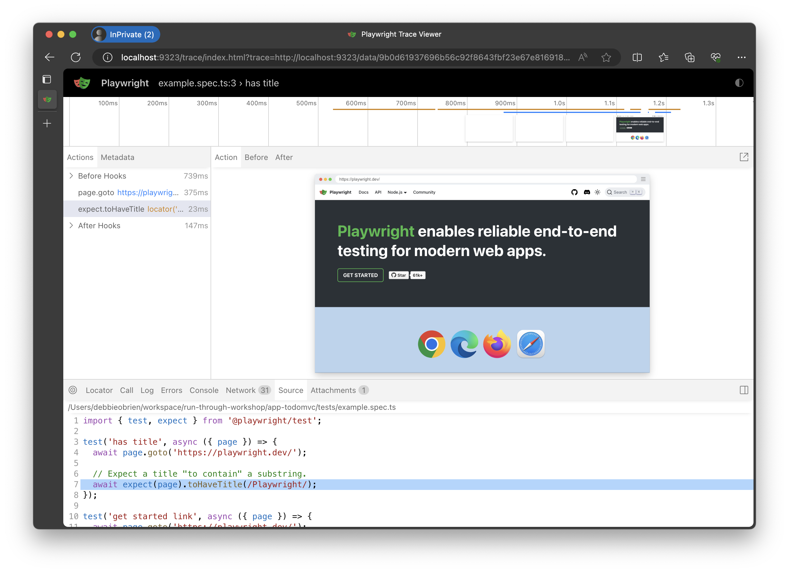
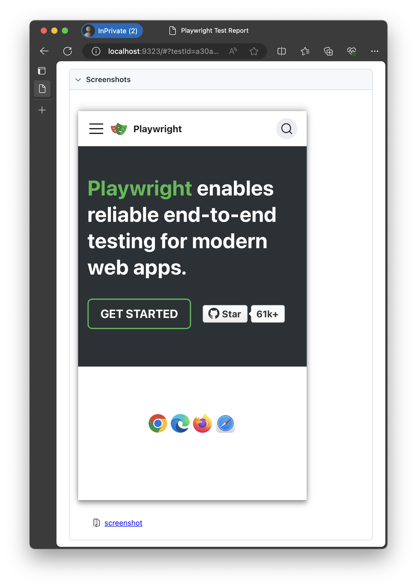

# Exercise: Deconstruct a Playwright Test

In the previous section, we installed Playwright using the CLI and ran the example test and opened the HTML report. In this section we will dive deeper into the Playwright Test _Specification_ and _Configuration_.

Let's get started.

## Step 1: Understand TestConfig

Let's open the project we created in the previous section in our favorite code editor and explore the files that Playwright installed. We will be using Visual Studio Code for this workshop.

Let's start by learning about Playwright Test _configuration_. 
 - The [`playwright.config.ts`](https://playwright.dev/docs/test-configuration#basic-configuration) file defines the default Test Runner configuration. 
 - The [TestConfig](https://playwright.dev/docs/api/class-testconfig) API describes the available configuration properties for customization.
 - The [Playwright Test CLI](https://playwright.dev/docs/test-cli) lets you override config properties or file location at runtime.

Let's see what the default configuration file provided by Playwright (on first setup) looks like. The `playwright.config.ts` snippet below was simplified for clarity.

```js
import { defineConfig, devices } from '@playwright/test';

export default defineConfig({
  testDir: './tests',
  fullyParallel: true,
  forbidOnly: !!process.env.CI,
  retries: process.env.CI ? 2 : 0,
  workers: process.env.CI ? 1 : undefined,
  reporter: 'html',

  use: {
    trace: 'on-first-retry',
  },

  projects: [
    {
      name: 'chromium',
      use: { ...devices['Desktop Chrome'] },
    },

    {
      name: 'firefox',
      use: { ...devices['Desktop Firefox'] },
    },

    {
      name: 'webkit',
      use: { ...devices['Desktop Safari'] },
    },
  ],
});
```
We can refer to the [Basic Configuration](https://playwright.dev/docs/test-configuration#basic-configuration) documentation to understand what this does:
 - [`testDir`](https://playwright.dev/docs/api/class-testconfig#test-config-test-dir) = top-level directory to scan recursively for test files.
 - [`fullyParallel`](https://playwright.dev/docs/api/class-testconfig#test-config-fully-parallel) = decide if all tests in all files should run in parallel
 - [`forbidOnly`](https://playwright.dev/docs/api/class-testconfig#test-config-forbid-only) = exit with error if `test.only` is used (e.g., useful on CI)
 - [`retries`](https://playwright.dev/docs/api/class-testconfig#test-config-retries) = max #retries per test (useful for _web-first assertions_)
 - [`workers`](https://playwright.dev/docs/api/class-testconfig#test-config-workers) = max # of concurrent worker processes (for parallelizing tests)
 - [`reporter`](https://playwright.dev/docs/api/class-testconfig#test-config-reporter) = select from available reporter options ( built-in and custom)
 - [`use`](https://playwright.dev/docs/api/class-testconfig#test-config-use) = set _[global options](https://playwright.dev/docs/test-use-options)_ for all tests (can be [overriden](https://playwright.dev/docs/test-use-options#configuration-scopes) at project or test scope)
 - [`projects`](https://playwright.dev/docs/api/class-testconfig#test-config-projects) = run tests in _multiple configurations_ (think browsers, emulators, options)

### 3.1 Configure Test Dir

The `testDir` property tells Playwright where to look for test files. By default, it is set to `./tests` which means that Playwright will look for test files in the `tests` folder. If you have your test files in a different folder, you can change this property to point to that folder. 

Let's change the `testDir` property to `.` so that Playwright looks for test files in the root of the project. 

```js
export default defineConfig({
  testDir: '.',
  ..
});
```

Now that we have updated the `testDir` property, let's run the tests again and see what happens.

```bash
npx playwright test
```

This time, Playwright will look for test files in the root of the project and run the tests. 

```bash
Running 78 tests using 5 workers
  78 passed (15.4s)

To open last HTML report run:

  npx playwright show-report
```
Wow, that's a lot of tests. Let's open the HTML report to see what happened.

```bash
npx playwright show-report
```



The report tells us that tests were run in `tests/example.spec.ts` and `tests-examples/demo-todo-app.spec.ts` and on the 3 different browser engines - `chromium`, `firefox`, and `webkit`. As we set the testDir to the root of the project, Playwright found all the test files in the project and ran them.

Let's set the `testDir` back to `./tests` so we can move on to the next exercise.

```js
export default defineConfig({
  testDir: './tests',
  ..
});
```

### 3.1 Configure Projects

A project is a group of tests that run with the same configuration and can be used to run tests on different browsers and devices. In the last section we saw how we can run a test on the Chromium browser by adding the `--project` option after the test command in the CLI. 

Projects are defined in the `projects` array in the configuration file. By default Playwright comes with 3 projects already defined, _chromium_, _firefox_ and _webkit_. This is why our tests ran on all 3 browsers. 

Each project has a _name_ property and a _use_ property. The _use_ option defines what the project should use. For example the device of Desktop Chrome for the chromium project.

```bash
  projects: [
    {
      name: 'chromium',
      use: { ...devices['Desktop Chrome'] },
    },
  ],
```

Comment out the other projects and leave only the _chromium_ project. Then run the tests.

```bash
npx playwright test
```
Excellent! We can see that we now have the 2 test cases running on a single browser project, giving us 2 test executions.

```bash
Running 2 tests using 2 workers
  2 passed (1.2s)

To open last HTML report run:

  npx playwright show-report
```

Let's run the `show-report` command and note how the report now only shows us the 2 tests on the one browser.



### 3.2 Explore Emulation

Playwright supports [Emulation](https://playwright.dev/docs/emulation) for mobile testing. You can select device profiles from the [supported emulation profiles](https://github.com/microsoft/playwright/blob/main/packages/playwright-core/src/server/deviceDescriptorsSource.json) and add it as a new project in the configuration file. 

Although you may have noticed that the default configuration file has a commented out section for testing against mobile viewports. Lets uncomment out the project for `Mobile Safari`.

```bash
  projects: [
    {
      name: 'chromium',
      use: { ...devices['Desktop Chrome'] },
    },
    
    {
      name: 'Mobile Safari',
      use: { ...devices['iPhone 12 Pro'] },
    },
  ],
```

Here is what the [profile description](https://github.com/microsoft/playwright/blob/main/packages/playwright-core/src/server/deviceDescriptorsSource.json) for the `iPhone 12 Pro`looks like:

```json
  "iPhone 12 Pro": {
    "userAgent": "Mozilla/5.0 (iPhone; CPU iPhone OS 14_4 like Mac OS X) AppleWebKit/605.1.15 (KHTML, like Gecko) Version/17.0 Mobile/15E148 Safari/604.1",
    "screen": {
      "width": 390,
      "height": 844
    },
    "viewport": {
      "width": 390,
      "height": 664
    },
    "deviceScaleFactor": 3,
    "isMobile": true,
    "hasTouch": true,
    "defaultBrowserType": "webkit"
  },
```

Let's run our tests again.

```bash
npx playwright test
```
This will run our two tests on the `chromium` and `Mobile Safari` projects. We can see that we now have 2 test executions.

```bash
Running 4 tests using 4 workers
  4 passed
```
This time, lets open the report to see what happened.

```bash
npx playwright show-report
```
This will serve the report on a local server and open the browser to that URL.

```bash
Serving HTML report at http://localhost:9323. Press Ctrl+C to quit.
```

Note how the same 2 test cases are executed, now with the `chromium` browser and the `iPhone 12 Pro` device emulator. We can see that the emulator takes a little longer to run each test compared to the browser engines.



We can [override the default profile properties](https://playwright.dev/docs/emulation) via the Playwright configuration file (global) or within a Test Specification file (local override) - but to try that out, we first need to understand the `use` directive.

### 3.3 Explore `use` Options

Playwright has a [`use` property](https://playwright.dev/docs/test-use-options) to configure the Test Runner for the following features:
 - [Basic](https://playwright.dev/docs/test-use-options#basic-options) - set `baseURL` (maps to "/" route) and `storageState` (e.g., load auth).
 - [Emulation](https://playwright.dev/docs/test-use-options#emulation-options) - emulates a real device e.g., mobile or tablet
 - [Network](https://playwright.dev/docs/test-use-options#network-options) - configure connections e.g., provide credentials for HTTP auth
 - [Recording](https://playwright.dev/docs/test-use-options#recording-options) - capture traces to help with debugging, or screenshots or video

These options can be set globally, in the config file (for all tests) or locally for a specific test or group of tests only.

Let's try to `use` the Recording feature to turn on traces and take a screenshot for our projects. This should let us get a _visual_ and _system_ level understanding of what happens in test execution. Update the _top-level_ `use` object in your `playwright.config.ts` as follows:

```js
export default defineConfig({
  testDir: './tests',
  ..

  use: {
    trace: 'on',
    screenshot: 'on',
  },
  ..
});
```

Let's run the test again.

```bash
npx playwright test
```

Note how the total time taken to run the tests has increased drastically. Turning on traces and recording media are _time-intensive_ actions and should be used with discretion - typically to help debug issues.

```bash
Running 4 tests using 3 workers
  4 passed
```
Lets open the HTML report to see what happened.

```bash
npx playwright show-report
```

```bash
Serving HTML report at http://localhost:9323. Press Ctrl+C to quit.
```



Turning on options like recording are expensive, so use with discretion - e.g., for debugging on CI.

Let's take a look at the detail view of one of our tests using the `chromium` project as defined in our config file.


 1. This time, the detail view includes a screenshot (from `page.goto`). This is useful for visual regression testing.

 1. Most importantly, we get a link to a trace of our test. To open the trace click on the trace icon in the list view or the image of the trace when in the detail view of the test.

 1. The trace gives us a detailed view of our test where we can easily step through each action as well as explore the network requests, console and even pop out the DOM snapshot and inspect it (think debugging!). Let's explore this in more detail in the next section.


Let's go back to the report and select one of tests run on the our `Mobile Safari` project. The detail page for the mobile project reflects the emulated profile view where once again we can explore the trace for our emulated test.


Turning on traces for every test run is not recommended for _production_ runs. Let's change the config back to run traces on the first retry of a failed tests that way if our test fails on CI we will have a trace to help debug the issue. 

Let's also remove the screenshot option as we don't need that for now.

```js
export default defineConfig({
  testDir: './tests',
  ..

  use: {
    trace: 'on-first-retry',
  },
  ..
});
```

We covered a lot here, and need to move on. But as a challenge to yourself - try out some of the other `use` options and run tests to see how execution and reporting change. For example - try [emulating](https://playwright.dev/docs/test-use-options#emulation-options) a `dark` color scheme or changing the `viewport` to override the device profile defaults.

🚀 | You learned a lot about Test Configuration. Now let's explore Test Specification.

## Step 4: Understand Test Spec


### 4.1 View Example Specification

The default test runs on the `tests/example.spec.ts` specification. Let's unpack that to see what it contains:

```js
import { test, expect } from '@playwright/test';

test('has title', async ({ page }) => {
  await page.goto('https://playwright.dev/');

  // Expect a title "to contain" a substring.
  await expect(page).toHaveTitle(/Playwright/);
});

test('get started link', async ({ page }) => {
  await page.goto('https://playwright.dev/');

  // Click the get started link.
  await page.getByRole('link', { name: 'Get started' }).click();

  // Expects page to have a heading with the name of Installation.
  await expect(page.getByRole('heading', { name: 'Installation' })).toBeVisible();
});
```

If you've done _test-driven development_ or _end-to-end testing_, the structure and format of the tests should be familiar. But you may see a few new concepts too. Before we dive into those, let's talk about test structure.

### 4.2 Understand Test Hierarchy

Here is how we organize our tests in Playwright.

- Every `test()` method in that specification is a [Test Case](https://playwright.dev/docs/api/class-testcase). When run in a configuration with multiple projects, each project will _instantiate_ a version of this Test Case and configure it to suit project requirements.
- Every executable statement within the Test Case is a test action that can be tracked in the reporter, trace-viewer, or UI mode tooling flows.
- Test cases can be _grouped explicitly_ into [Test Suites](https://playwright.dev/docs/api/class-suite) using the `test.describe()` function. You can see an example of this in our `test-examples/demo-todo-app-spec.ts`. We'll revisit this later.
- Test cases are _grouped implicitly_ into Suites based on the project they belong to, and the file they are contained in. This allows Playwright to target groups of tests in various ways for execution.
- Every test run has a _Root suite_, with a child _Project suite_ for each configured project. Project suites have child _File suites_ for each test specification identified for that run. The File suite can have _Test Case_ objects (individual) and _Test Suite_ objects(explicitly grouped using `describe`) as children.

The `test.describe` directive is an example of a [Playwright Annotation](https://playwright.dev/docs/test-annotations#group-tests). It allows us to group Test Case objects logically in a file so we can do things like apply _beforeEach_ and _afterEach_ hooks to all tests within a group. See the snippet from `test-examples/demo-todo-app.spec.ts` below for reference.

```js
test.describe('Mark all as completed', () => {
  test.beforeEach(async ({ page }) => {
    await createDefaultTodos(page);
    await checkNumberOfTodosInLocalStorage(page, 3);
  });

  test.afterEach(async ({ page }) => {
    await checkNumberOfTodosInLocalStorage(page, 3);
  });

  test('should allow me to mark all items as completed', async ({ page }) => {
    // test actions details omitted for clarity
  });

  test('should allow me to clear the complete state of all items', async ({ page }) => {
    // test actions details omitted for clarity
  });

  test('complete all checkbox should update state when items are completed / cleared', async ({ page }) => {
    // test actions details omitted for clarity
  });
});
```
 
### 4.3 Understand Test Structure

We can look at either of the two Test Specification snippets above (the first from `example.spec.ts`, the second from `demo-todo-app.spec.ts`) for this discussion - but let's use the second one since it has a bit more detail that is relevant.

Playwright tests generally follow the [Arrange-Act-Assert](https://automationpanda.com/2020/07/07/arrange-act-assert-a-pattern-for-writing-good-tests/) pattern:
 1. **Arrange** - sets up the environment for the test. This can include providing the right fixtures, but also running `beforeEach`/`beforeAll` hooks that set up the initial state for that test.
 1. **Act** - these are the steps within the test that _locate_ the right elements to interact with, and then take _actions_ on them. For instance, the test may [locate a button](https://playwright.dev/docs/api/class-locator#locator-get-by-role) and then [click it](https://playwright.dev/docs/writing-tests#basic-actions). Other actions include _check/uncheck_ (checkboxes), _fill_ (forms), _hover_ (mouseover), _focus_ (on element), _press_ (single key) etc.
 1. **Assert** - these statements validate expected outcomes from the actions. Playwright supports [web-first assertions](https://playwright.dev/docs/test-assertions) where [generic assertions](https://playwright.dev/docs/api/class-genericassertions) (using `expect`) can be coupled with [async matchers](https://playwright.dev/docs/api/class-locatorassertions)(for the `Locator`) to make sure that the target element is ready before evaluating the asserted condition.

Once you understand this, it becomes easier to understand, author, and refine, your test specifications using Playwright tooling. 

### 4.4 Understand Test Components

Let's see these concepts in action by reviewing the example spec from section 4.2.

```js
import { test, expect } from '@playwright/test';

test('has title', async ({ page }) => {
  await page.goto('https://playwright.dev/');

  // Expect a title "to contain" a substring.
  await expect(page).toHaveTitle(/Playwright/);
});

test('get started link', async ({ page }) => {
  await page.goto('https://playwright.dev/');

  // Click the get started link.
  await page.getByRole('link', { name: 'Get started' }).click();

  // Expects page to have a heading with the name of Installation.
  await expect(page.getByRole('heading', { name: 'Installation' })).toBeVisible();
});
```
1. (Arrange) - there are no explicit hooks in this test spec, however `page` is a [Fixture](https://playwright.dev/docs/test-fixtures#built-in-fixtures) that also supports this goal.
2. (Act) - the `page.goto` is an example of a [Navigation](https://playwright.dev/docs/writing-tests#navigation) action where the browser automates the user action of navigating to that URL.
3. (Assert) - the `expect.(<locator>).toBeVisible()` is an example of a [LocatorAssertion](https://playwright.dev/docs/api/class-locatorassertions#locator-assertions-to-be-visible) where Playwright will wait for the located element to be ready (using retries) before evaluating the assertion (is it visible?).

With this simple example, you know three powerful concepts in Playwright Testing:
 * [Fixtures](https://playwright.dev/docs/test-fixtures) - for establishing environment and _test isolation_. 
 * [Locators](https://playwright.dev/docs/locators) - for finding elements with _auto-wait and auto-retry_.
 * [Assertions](https://playwright.dev/docs/test-assertions) - for validating outcomes of automated actions _web-assertions_.

Take a few minutes to familiarize yourself with the documentation for those three features and APIs - and you should be all set to dive into _designing and authoring_ an end-to-end specification for the sample application.

🚀 | Excellent! Now let's talk about the core Developer Tools for Playwright! 
