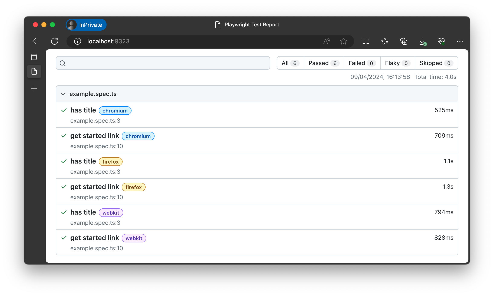
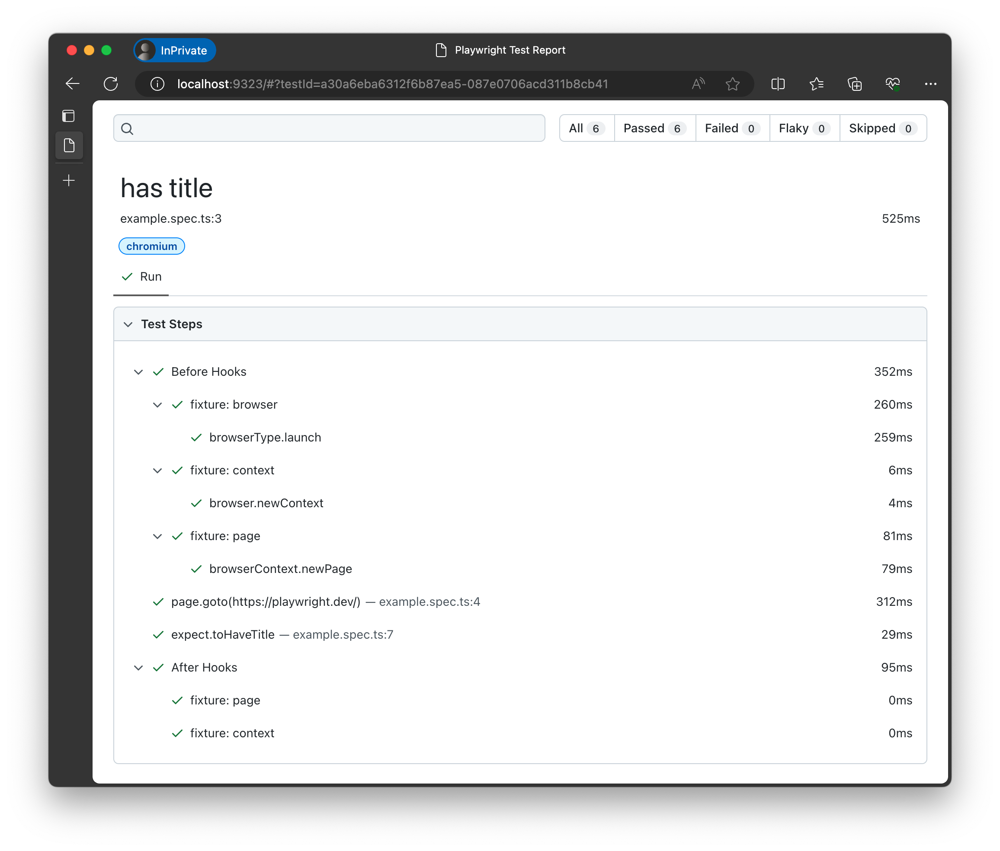

# Exercise: Deconstruct a Playwright Test

In the previous section, we did quick tests to validate our development environment, sample application, and Playwright setup. In this section, we dive deeper into concepts like the Playwright Test _Specification_, _Configuration_, _Reporting_ and _Commandline_ for running tests.

Let's get started.

## Step 1: Run Example Test Spec

Recall that we reset our `testDir` to point to `tests/`. That means the Playwright Test runner will only find specifications within the `tests/*` sub-tree. Right now that contains a single file - `example.spec.ts` - which is provided by default when you initialize a new Playwright project.

Let's run the test. We get the following output - indicating that all tests passed. But what does `6 tests` and `3 workers` mean given we only had one test specfication?

```bash
$ npx playwright test

Running 6 tests using 3 workers
  6 passed (8.2s)

To open last HTML report run:
  npx playwright show-report
```

## Step 2: View Test Report

Let's see if the HTML report gives us any more information. Note that again, GitHub Codespaces forwards the port for the report server so you can view it on the browser in your host machine.

```bash
$ npx playwright show-report
  Serving HTML report at http://localhost:9323. Press Ctrl+C to quit.
```

Opening the browser to that URL shows us a report with these insights:
 - We have 2 test cases ("has title", "get started link")
 - We ran each across 3 browser engines (chromium, firefox, webkit)
 - The test cases were defined in the `example.spec.ts` file
 - The test run tool _9.8s_ with all 6 tests passing (none skipped)



Clicking on a particular row gives you the detailed run of that test case:
 - This test case was run on Chromium
 - The "Before Hooks" ran first. This set _context_ (fixtures) for test isolation.
 - The Test "Action" ran next. This resulted in a _navigation_ to a specific page.
 - The Test "Assertion" executes. This _validates_ that page has a specific title.
 - The "After Hooks" run last. They take any context _cleanup_ actions needed. 
 - This test case took "894 ms" to complete - with _navigation_ taking most time.



This answers our question on what the `6 tests` were. But what does `3 workers` mean? And where did we define these configuration parameters and test specification actions? 

## Step 3: Understand TestConfig

Let's start by learning about Playwright Test _configuration_. 
 - The [`playwright.config.ts`](https://playwright.dev/docs/test-configuration#basic-configuration) file defines the default Test Runner configuration. 
 - The [TestConfig](https://playwright.dev/docs/api/class-testconfig) API describes the available configuration properties for customization.
 - The [Playwright Test CLI](https://playwright.dev/docs/test-cli) lets you override config properties or file location at runtime.

Let's see what the default configuration file provided by Playwright (on first setup) looks like. The `playwright.config.ts` snippet below was simplified for clarity.

```js
import { defineConfig, devices } from '@playwright/test';

export default defineConfig({

  testDir: './tests',
  fullyParallel: true,
  forbidOnly: !!process.env.CI,
  retries: process.env.CI ? 2 : 0,
  workers: process.env.CI ? 1 : undefined,
  reporter: 'html',

  use: {
    trace: 'on-first-retry',
  },

  projects: [
    {
      name: 'chromium',
      use: { ...devices['Desktop Chrome'] },
    },

    {
      name: 'firefox',
      use: { ...devices['Desktop Firefox'] },
    },

    {
      name: 'webkit',
      use: { ...devices['Desktop Safari'] },
    },
  ],

  /* Run your local dev server before starting the tests */
  // webServer: {
  //   command: 'npm run start',
  //   url: 'http://127.0.0.1:3000',
  //   reuseExistingServer: !process.env.CI,
  // },
});
```
We can refer to the [Basic Configuration](https://playwright.dev/docs/test-configuration#basic-configuration) documentation to understand what this does:
 - [`testDir`](https://playwright.dev/docs/api/class-testconfig#test-config-test-dir) = top-level directory to scan recursively for test files.
 - [`fullyParallel`](https://playwright.dev/docs/api/class-testconfig#test-config-fully-parallel) = decide if all tests in all files should run in parallel
 - [`forbidOnly`](https://playwright.dev/docs/api/class-testconfig#test-config-forbid-only) = exit with error if `test.only` is used (e.g., useful on CI)
 - [`retries`](https://playwright.dev/docs/api/class-testconfig#test-config-retries) = max #retries per test (useful for _web-first assertions_)
 - [`workers`](https://playwright.dev/docs/api/class-testconfig#test-config-workers) = max # of concurrent worker processes (for parallelizing tests)
 - [`reporter`](https://playwright.dev/docs/api/class-testconfig#test-config-reporter) = select from available reporter options ( built-in and custom)
 - [`use`](https://playwright.dev/docs/api/class-testconfig#test-config-use) = set _[global options](https://playwright.dev/docs/test-use-options)_ for all tests (can be [overriden](https://playwright.dev/docs/test-use-options#configuration-scopes) at project or test scope)
 - [`projects`](https://playwright.dev/docs/api/class-testconfig#test-config-projects) = run tests in _multiple configurations_ (think browsers, emulators, options)
 - [`webServer`](https://playwright.dev/docs/api/class-testconfig#test-config-web-server) = launch webserver(s) hosting app(s) to test (waits till ready to start)

We'll revisit the _webServer_ option in a future exercise when we build the sample application test suite. For now, let's try modifying one or more of these properties to see how this works.

### 3.1 Configure Projects

First, update the `projects` object in the configuration file to comment out or remove the other browser options, leaving just one as shown:

```bash

  projects: [
    {
      name: 'chromium',
      use: { ...devices['Desktop Chrome'] },
    },
  ],
```

Run the test - excellent! We can see that we now have the 2 test cases running on a single browser project, giving us 2 test executions.

```bash
$ npx playwright test

Running 2 tests using 2 workers
  2 passed (1.9s)
```

### 3.2 Explore Emulation

Playwright supports [Emulation](https://playwright.dev/docs/emulation) for mobile testing - select a device profile from the [supported emulation profiles](https://github.com/microsoft/playwright/blob/main/packages/playwright-core/src/server/deviceDescriptorsSource.json) and add it as a new project in the configuration file. 

```bash

  projects: [
    {
      name: 'chromium',
      use: { ...devices['Desktop Chrome'] },
    },
    {
      name: 'iPhone 12 Pro',
      use: { ...devices['iPhone 12 Pro'] },
    },
  ],
```
I chose the `iPhone 12 Pro`. Here is that [that profile description](https://github.com/microsoft/playwright/blob/main/packages/playwright-core/src/server/deviceDescriptorsSource.json) looks like:

```json
  "iPhone 12 Pro": {
    "userAgent": "Mozilla/5.0 (iPhone; CPU iPhone OS 14_4 like Mac OS X) AppleWebKit/605.1.15 (KHTML, like Gecko) Version/17.0 Mobile/15E148 Safari/604.1",
    "screen": {
      "width": 390,
      "height": 844
    },
    "viewport": {
      "width": 390,
      "height": 664
    },
    "deviceScaleFactor": 3,
    "isMobile": true,
    "hasTouch": true,
    "defaultBrowserType": "webkit"
  },
```

Let's run the test again - and this time, open the report to see what happened.

```bash
$ npx playwright test
Running 4 tests using 3 workers
  4 passed (4.5s)

$ npx playwright show-report
  Serving HTML report at http://localhost:9323. Press Ctrl+C to quit.
```

Note how the same 2 test cases are executed, now with the `chromium` browser and the `iPhone 12 Pro` device emulator. We can see that the emulator takes a little longer to run each test compared to the browser engines.


We can [override the default profile properties](https://playwright.dev/docs/emulation) via the Playwright configuration file (global) or within a Test Specification file (local override) - but to try that out, we first need to understand the `use` directive.

### 3.3 Explore `use` Options

Playwright has a [`use` property](https://playwright.dev/docs/test-use-options) to configure Test Runner for the following features:
 - [Basic](https://playwright.dev/docs/test-use-options#basic-options) - set `baseURL` (maps to "/" route) and `storageState` (e.g., load auth).
 - [Emulation](https://playwright.dev/docs/test-use-options#emulation-options) - a real device e.g., mobile or tablet
 - [Network](https://playwright.dev/docs/test-use-options#network-options) - configure connections e.g., provide credentials for HTTP auth
 - [Recording](https://playwright.dev/docs/test-use-options#recording-options) - capture traces, screenshots or video to help debug

These options can be set at the [Browser](https://playwright.dev/docs/api/class-browser) level (for all tests on that browser) or the [BrowserContext](https://playwright.dev/docs/api/class-browsercontext) level (for tests on a specific `page` session in Browser).

Let's try to `use` the Recording feature to turn on traces and take a screenshot for our projects. This should let us get a _visual_ and _system_ level understanding of what happens in test execution. Update the _top-level_ `use` object in your `playwright.config.ts` as follows:

```js
use: {
    trace: 'on',
    screenshot: 'on',
    video: 'on'
  },
```

Let's run the test again - and this time, open the report to see what happened. Note how the total time taken has increased drastically (from ~4s to 7s). Turning on traces and recording media are _time-intensive_ actions and should be used with discretion - typically to help debug issues.

```bash
$ npx playwright test
Running 4 tests using 3 workers
  4 passed (7.2s)

$ npx playwright show-report
  Serving HTML report at http://localhost:9323. Press Ctrl+C to quit.
```

Here's what the new report tells us about the power of `use`:

 1. Turning on options like recording are expensive (see increase in execution times) so use with discretion - e.g., for debugging.
    
 1. Let's take a look at the detail for a browser project.

 1. This time, the detail view includes a screenshot (from `page.goto`).

 1. And we get a video (think "visual walkthrough" of test case).

 1. And most importantly, we get a detailed trace view (think debugging!).

 1. The detail page for the mobile project reflects the emulated profile view

 1. And we can use the "video walkthrough" to manually responsiveness etc.


We covered a lot here, and need to move on. But as a challenge to yourself - try out some of the other `use` options and run tests to see how execution and reporting change. For example - try [emulating](https://playwright.dev/docs/test-use-options#emulation-options) a `dark` color scheme or changing the `viewport` to override the device profile defaults.

🚀 | You learned a lot about Test Configuration. Now let's explore Test Specification.

## Step 4: Understand Test Spec

### 4.1 Reset To Default Config

🛑 | Before we continue - note that we made a lot of changes to the `playwright.config.ts` file in the previous section. Let's reverse it and get back to our default configuration state. 

The easiest way is to _copy back_ the original file as follows - run a quick test to make sure that worked.
```bash
$ cp tests-examples/orig-playwright.config.ts  playwright.config.ts 

$ npx playwright test
Running 6 tests using 3 workers
  6 passed (8.0s)
```
Excellent - we are now ready to talk about Test Specifications!

### 4.2 View Example Specification

The default test runs on the `tests/example.spec.ts` specification. Let's unpack that to see what it contains:

```js
import { test, expect } from '@playwright/test';

test('has title', async ({ page }) => {
  await page.goto('https://playwright.dev/');

  // Expect a title "to contain" a substring.
  await expect(page).toHaveTitle(/Playwright/);
});

test('get started link', async ({ page }) => {
  await page.goto('https://playwright.dev/');

  // Click the get started link.
  await page.getByRole('link', { name: 'Get started' }).click();

  // Expects page to have a heading with the name of Installation.
  await expect(page.getByRole('heading', { name: 'Installation' })).toBeVisible();
});
```

If you've done _test-driven development_ or _end-to-end testing_, the structure and format of the tests should be familiar. But you may see a few new concepts too. Before we dive into those, let's talk about test structure.

### 4.3 Understand Test Hierarchy

Here is how we organize our tests in Playwright.

- Every `test()` method in that specification is a [Test Case](https://playwright.dev/docs/api/class-testcase). When run in a configuration with multiple projects, each project will have _instantiate_ a version of this Test Case and configure it to suit project requirements.
- Every executable statement within the Test Case is a test action that can be tracked in reporter, trace-viewer, or UI mode tooling flows.
- Test cases can be _grouped explicitly_ into [Test Suites](https://playwright.dev/docs/api/class-suite) using `test.describe()` function. You can see an example of this in our `test-examples/demo-todo-app-spec.ts`. We'll revisit this later.
- Test cases are _grouped implicitly_ into Suites based on the project they belong to, and the file they are contained in. This allows Playwright to target groups of tests in various ways for execution.
- Every test run has a _Root suite_, with a child _Project suite_ for each configured project. Project suites have child _File suites_ for each test specification identified for that run. The File suite can have _Test Case_ objects (individual) and _Test Suite_ objects(explicitly grouped using `describe`) as children.

The `test.describe` directive is an example of a [Playwright Annotation](https://playwright.dev/docs/test-annotations#group-tests). It allows us to group Test Case objects logically in a file so we can do things like apply _beforeEach_ and _afterEach_  hooks to all tests within a group. See the snippet from `test-examples/demo-todo-app.spec.ts` below for reference.

```js
test.describe('Mark all as completed', () => {
  test.beforeEach(async ({ page }) => {
    await createDefaultTodos(page);
    await checkNumberOfTodosInLocalStorage(page, 3);
  });

  test.afterEach(async ({ page }) => {
    await checkNumberOfTodosInLocalStorage(page, 3);
  });

  test('should allow me to mark all items as completed', async ({ page }) => {
    // test actions details omitted for clarity
  });

  test('should allow me to clear the complete state of all items', async ({ page }) => {
    // test actions details omitted for clarity
  });

  test('complete all checkbox should update state when items are completed / cleared', async ({ page }) => {
    // test actions details omitted for clarity
  });
}
```
 
### 4.4 Understand Test Structure

We can look at either of the two Test Specification snippets above (the first from `example.spec.ts`, the second from `demo-todo-app.spec.ts`) for this discussion - but let's use the second one since it has a bit more detail that is relevant.

Playwright tests generally follow the [Arrange-Act-Assert](https://automationpanda.com/2020/07/07/arrange-act-assert-a-pattern-for-writing-good-tests/) pattern:
 1. **Arrange** - sets up the environment for the test. This can include providing the right fixtures, but also running `beforeEach`/`beforeAll` hooks that set up the initial state for that test.
 1. **Act** - these are the steps within the test that _locate_ the right elements to interact with, and then take _actions_ on them. For instance, the test may [locate a button](https://playwright.dev/docs/api/class-locator#locator-get-by-role) and then [click it](https://playwright.dev/docs/writing-tests#basic-actions). Other actions include _check/uncheck_ (checkboxes), _fill_ (forms), _hover_ (mouseover), _focus_ (on element), _press_ (single key) etc.
 1. **Assert** - these statements validate expected outcomes from the actions. Playwright supports [web-first assertions](https://playwright.dev/docs/test-assertions) where [generic assertions](https://playwright.dev/docs/api/class-genericassertions) (using `expect`) can be coupled with [async matchers](https://playwright.dev/docs/api/class-locatorassertions)(for the `Locator`) to make sure that the target element is ready before evaluating the asserted condition.

Once you understand this, it becomes easier to understand, author, and refine, your test specifications using Playwright tooling. 

### 4.5 Understand Test Components

Let's see these concepts in action by reviewing the example spec from section 4.2.

```js
import { test, expect } from '@playwright/test';

test('has title', async ({ page }) => {
  await page.goto('https://playwright.dev/');

  // Expect a title "to contain" a substring.
  await expect(page).toHaveTitle(/Playwright/);
});

test('get started link', async ({ page }) => {
  await page.goto('https://playwright.dev/');

  // Click the get started link.
  await page.getByRole('link', { name: 'Get started' }).click();

  // Expects page to have a heading with the name of Installation.
  await expect(page.getByRole('heading', { name: 'Installation' })).toBeVisible();
});
```
1. (Arrange) - there are no explicit hooks in this test spec, but we'll talk about how `page` is a [Fixture](https://playwright.dev/docs/test-fixtures#built-in-fixtures) that also supports this goal.
2. (Act) - the `page.goto` is an example of a [Navigation](https://playwright.dev/docs/writing-tests#navigation) action where the browser automates the user action of navigating to that URL.
2. (Assert) - the `expect.(<locator>).toBeVisible()` is an example of a [LocatorAssertion](https://playwright.dev/docs/api/class-locatorassertions#locator-assertions-to-be-visible) where Playwright will wait for located element to be ready (using retries) before evaluating the assertion (is it visible?).

With this simple example, you know three powerful concepts in Playwright Testing:
 * [Fixtures](https://playwright.dev/docs/test-fixtures) - for establishing environment and _test isolation_. 
 * [Locators](https://playwright.dev/docs/locators) - for finding elements with _auto-wait and auto-retry_.
 * [Assertions](https://playwright.dev/docs/test-assertions) - for validating outcomes of automated actions _web-first_.

Take a few minutes to familiarize yourself with the documentation for those three features and APIs - and you should be all set to dive into _designing and authoring_ an end-to-end specification for the sample application.

🚀 | Excellent! Now let's talk about the core Developer Tools for Playwright! 