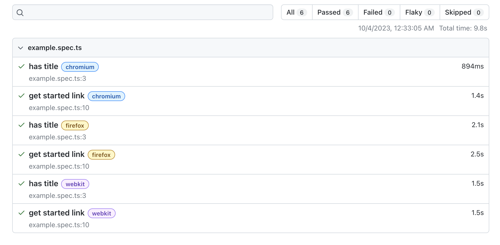
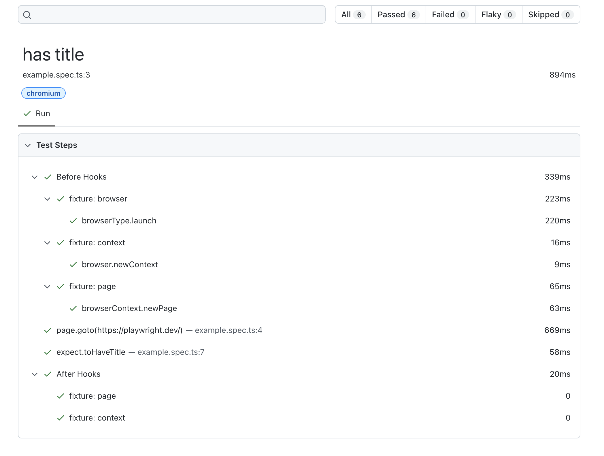

## 3.3 View Test Report

Let's see if the HTML report gives us any more information.

```bash
npx playwright show-report
```
Note that again, GitHub Codespaces forwards the port for the report server so you can view it on the browser in your host machine.

```bash
Serving HTML report at http://localhost:9323. Press Ctrl+C to quit.
```

Opening the browser to that URL shows us a report with these insights:
 - We have 2 test cases ("has title", "get started link")
 - We ran each across 3 browser engines (chromium, firefox, webkit)
 - The test cases were defined in the `example.spec.ts` file
 - The test run tool _9.8s_ with all 6 tests passing (none skipped)



Clicking on a particular row gives you the detailed run of that test case:
 - This test case was run on Chromium
 - The "Before Hooks" ran first. This set _context_ (fixtures) for test isolation.
 - The Test "Action" ran next. This resulted in a _navigation_ to a specific page.
 - The Test "Assertion" executes. This _validates_ that page has a specific title.
 - The "After Hooks" run last. They take any context _cleanup_ actions needed. 
 - This test case took "894 ms" to complete - with _navigation_ taking most time.



This answers our question on what the `6 tests` were. But what does `3 workers` mean? And where did we define these configuration parameters and test specification actions? 

By default Playwright runs tests in parallel. To do this it uses workers. The number of workers is determined by the number of CPU cores available. Playwright will use half of the available CPU cores. You can override this by setting the `workers` property in the [Playwright Configuration](https://playwright.dev/docs/test-configuration) file.