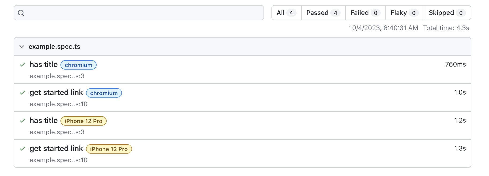

## 3.5 Configure Projects


### 3.5.1 Configure Browser Targets

First, update the `projects` object in the configuration file to comment out or remove the other browser options, leaving just one as shown:

```bash

  projects: [
    {
      name: 'chromium',
      use: { ...devices['Desktop Chrome'] },
    },
  ],
```

Run the test - excellent!

```bash
npx playwright test
```
We can see that we now have the 2 test cases running on a single browser project, giving us 2 test executions.

```bash
Running 2 tests using 2 workers
  2 passed (1.9s)
```

### 3.5.2 Configure Emulator Targets


Playwright supports [Emulation](https://playwright.dev/docs/emulation) for mobile testing - select a device profile from the [supported emulation profiles](https://github.com/microsoft/playwright/blob/main/packages/playwright-core/src/server/deviceDescriptorsSource.json) and add it as a new project in the configuration file. 

```bash

  projects: [
    {
      name: 'chromium',
      use: { ...devices['Desktop Chrome'] },
    },
    {
      name: 'iPhone 12 Pro',
      use: { ...devices['iPhone 12 Pro'] },
    },
  ],
```
I chose the `iPhone 12 Pro`. Here is that [that profile description](https://github.com/microsoft/playwright/blob/main/packages/playwright-core/src/server/deviceDescriptorsSource.json) looks like:

```json
  "iPhone 12 Pro": {
    "userAgent": "Mozilla/5.0 (iPhone; CPU iPhone OS 14_4 like Mac OS X) AppleWebKit/605.1.15 (KHTML, like Gecko) Version/17.0 Mobile/15E148 Safari/604.1",
    "screen": {
      "width": 390,
      "height": 844
    },
    "viewport": {
      "width": 390,
      "height": 664
    },
    "deviceScaleFactor": 3,
    "isMobile": true,
    "hasTouch": true,
    "defaultBrowserType": "webkit"
  },
```

Let's run the test again.

```bash
npx playwright test
```
This will run our two tests on both the `chromium` and `iPhone 12 Pro` projects. We can see that we now have 4 test executions.

```bash
Running 4 tests using 3 workers
  4 passed (4.5s)
```
This time, lets open the report to see what happened.

```bash
npx playwright show-report
```
This will serve the report on a local server - and open the browser to that URL.

```bash
Serving HTML report at http://localhost:9323. Press Ctrl+C to quit.
```

Note how the same 2 test cases are executed, now with the `chromium` browser and the `iPhone 12 Pro` device emulator. We can see that the emulator takes a little longer to run each test compared to the browser engines.



We can [override the default profile properties](https://playwright.dev/docs/emulation) via the Playwright configuration file (global) or within a Test Specification file (local override) - but to try that out, we first need to understand the `use` directive.