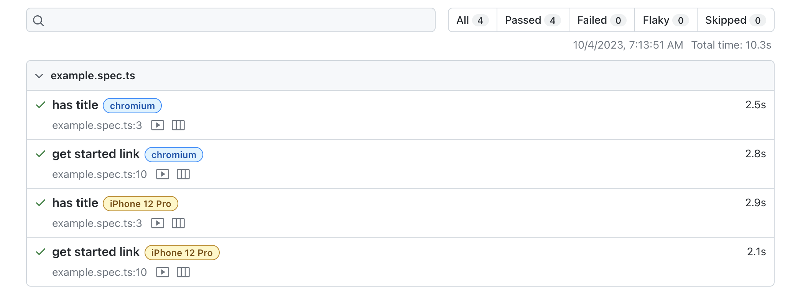
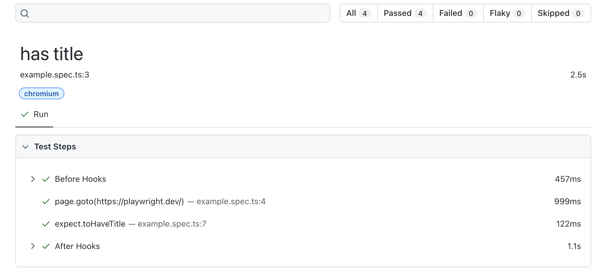
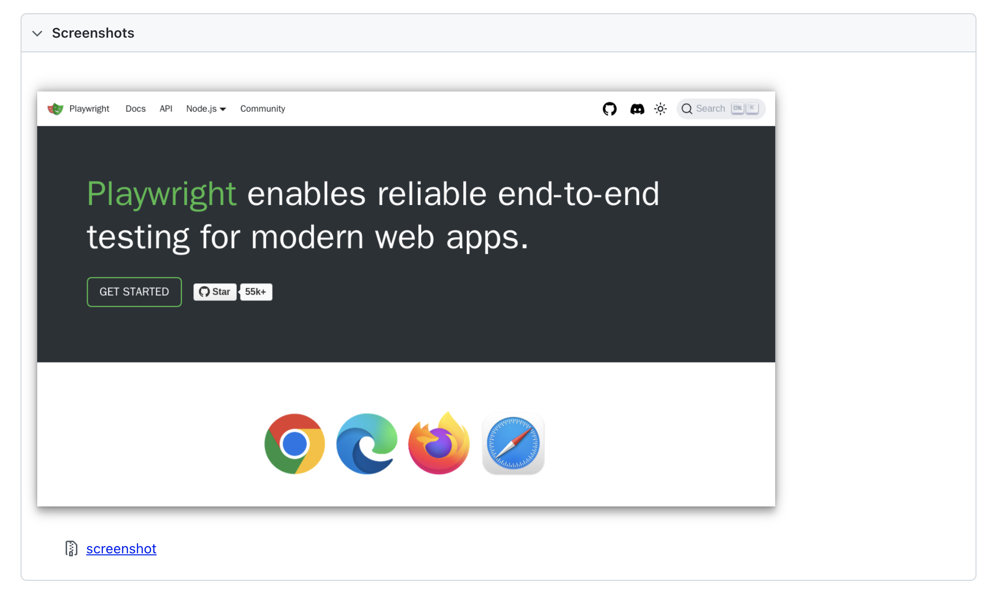
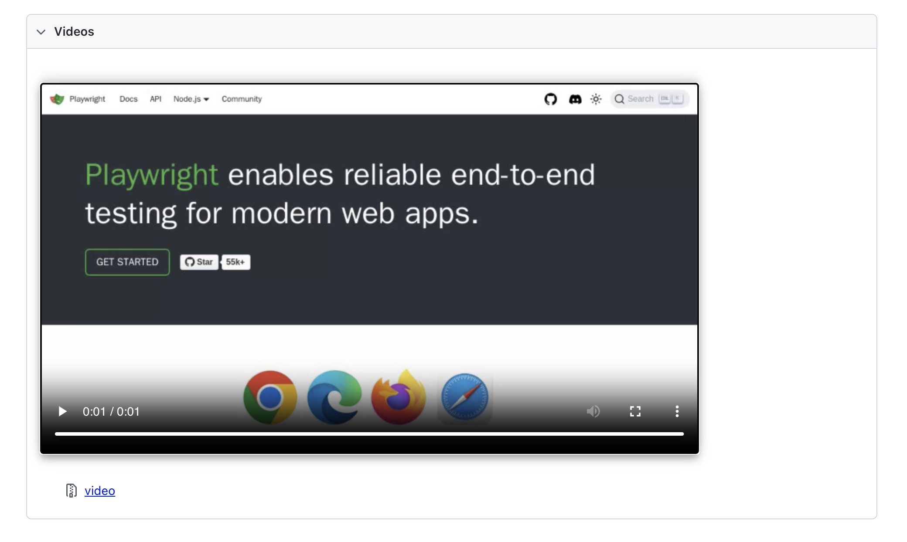
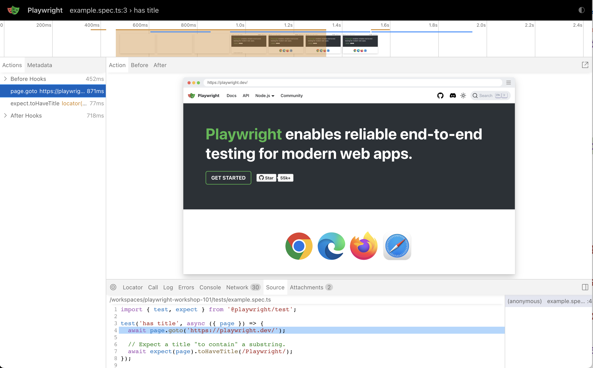
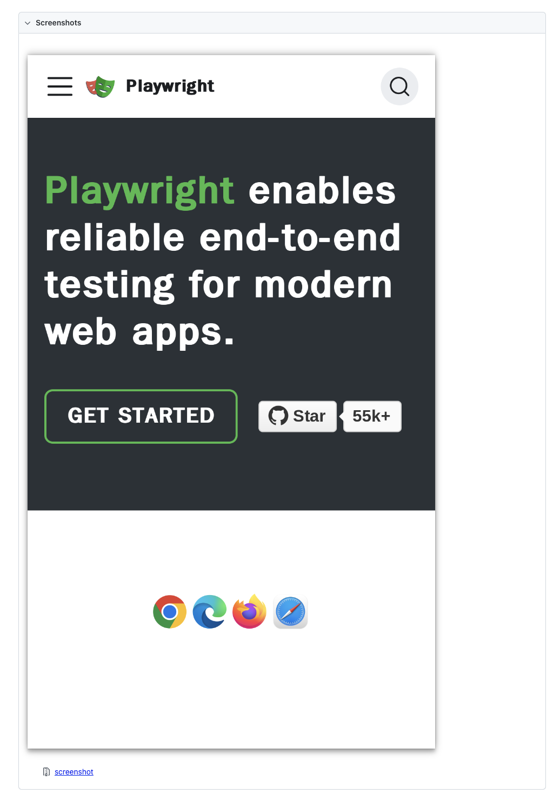
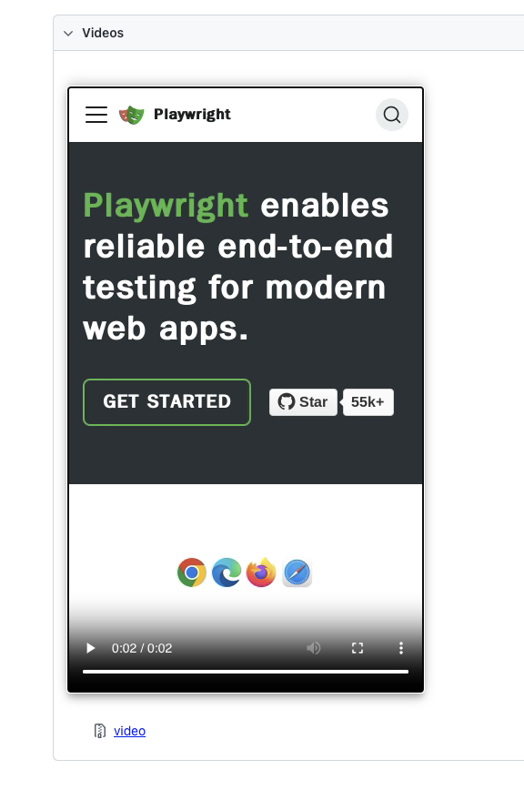

## 3.6 Configure `use` Options

Playwright has a [`use` property](https://playwright.dev/docs/test-use-options) to configure Test Runner for the following features:
 - [Basic](https://playwright.dev/docs/test-use-options#basic-options) - set `baseURL` (maps to "/" route) and `storageState` (e.g., load auth).
 - [Emulation](https://playwright.dev/docs/test-use-options#emulation-options) - a real device e.g., mobile or tablet
 - [Network](https://playwright.dev/docs/test-use-options#network-options) - configure connections e.g., provide credentials for HTTP auth
 - [Recording](https://playwright.dev/docs/test-use-options#recording-options) - capture traces, screenshots or video to help debug

These options can be set at the [Browser](https://playwright.dev/docs/api/class-browser) level (for all tests on that browser) or the [BrowserContext](https://playwright.dev/docs/api/class-browsercontext) level (for tests on a specific `page` session in Browser).

Let's try to `use` the Recording feature to turn on traces and take a screenshot for our projects. This should let us get a _visual_ and _system_ level understanding of what happens in test execution. Update the _top-level_ `use` object in your `playwright.config.ts` as follows:

```js
export default defineConfig({
  testDir: './tests',
  ..

  use: {
    trace: 'on',
    screenshot: 'on',
    video: 'on'
  },
  ..
});
```

Let's run the test again.

```bash
npx playwright test
```

Note how the total time taken has increased drastically (from ~4s to 7s). Turning on traces and recording media are _time-intensive_ actions and should be used with discretion - typically to help debug issues.

```bash
Running 4 tests using 3 workers
  4 passed (7.2s)
```
Lets open the HTML report to see what happened.

```bash
npx playwright show-report
```

```bash
Serving HTML report at http://localhost:9323. Press Ctrl+C to quit.
```

Here's what the new report tells us about the power of `use`:

 1. Turning on options like recording are expensive (see increase in execution times) so use with discretion - e.g., for debugging.
    
 1. Let's take a look at the detail for a browser project.

 1. This time, the detail view includes a screenshot (from `page.goto`).

 1. And we get a video (think "visual walkthrough" of test case).

 1. And most importantly, we get a detailed trace view (think debugging!).

 1. The detail page for the mobile project reflects the emulated profile view

 1. And we can use the "video walkthrough" to manually responsiveness etc.


We covered a lot here, and need to move on. But as a challenge to yourself - try out some of the other `use` options and run tests to see how execution and reporting change. For example - try [emulating](https://playwright.dev/docs/test-use-options#emulation-options) a `dark` color scheme or changing the `viewport` to override the device profile defaults.

🚀 | You learned a lot about Test Configuration. Now let's explore Test Specification.
