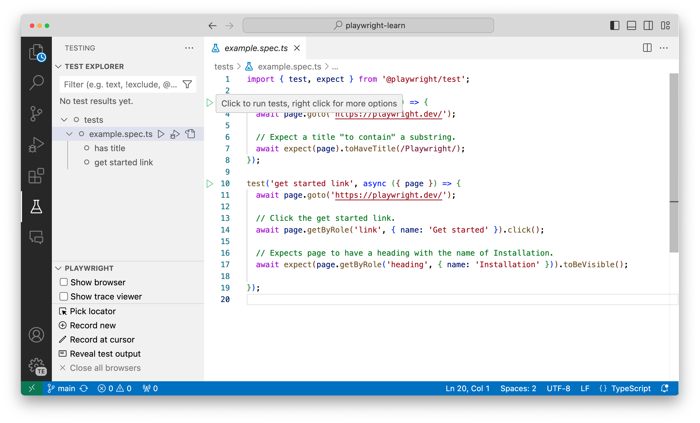
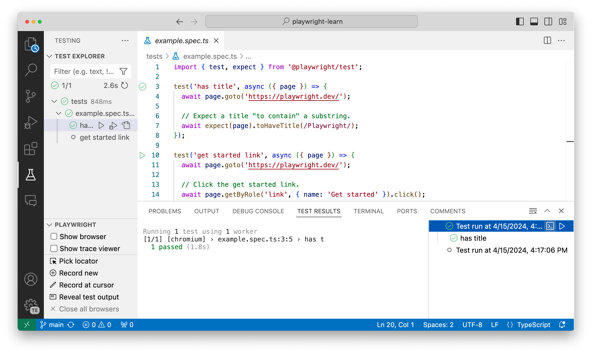
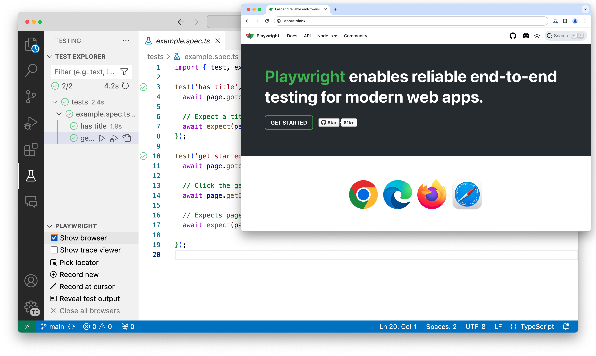
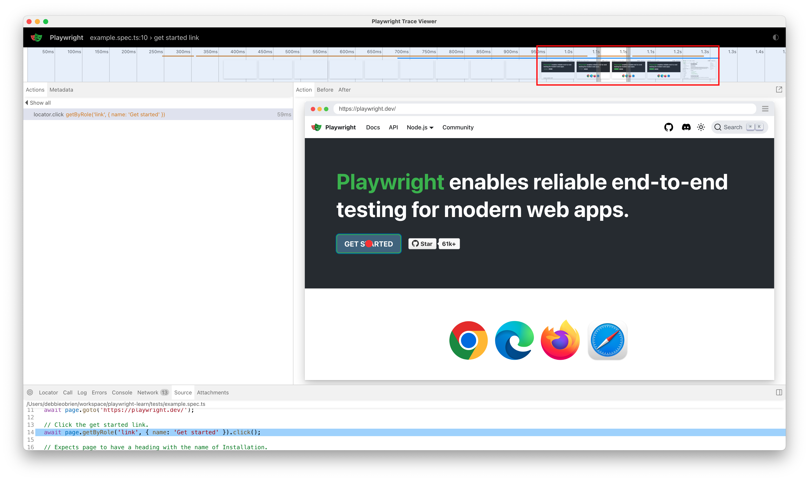
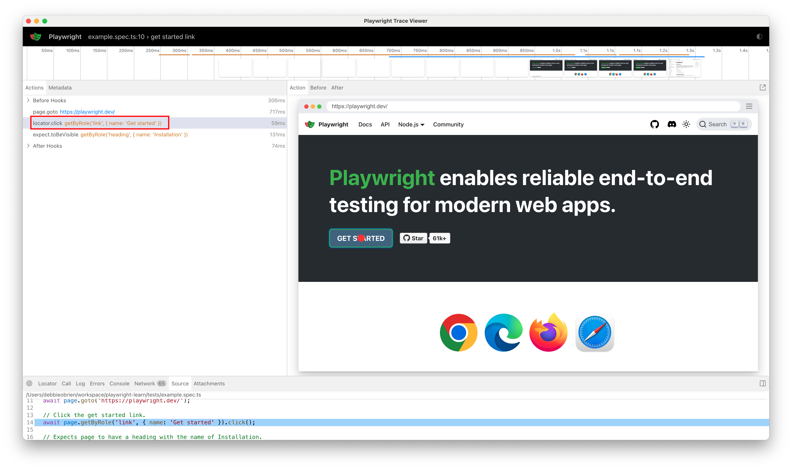
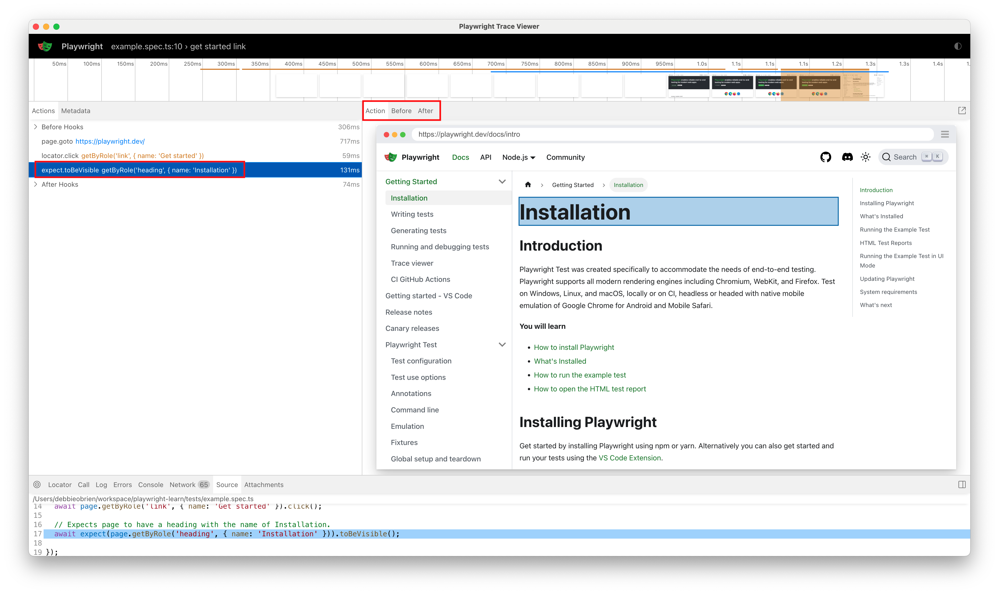
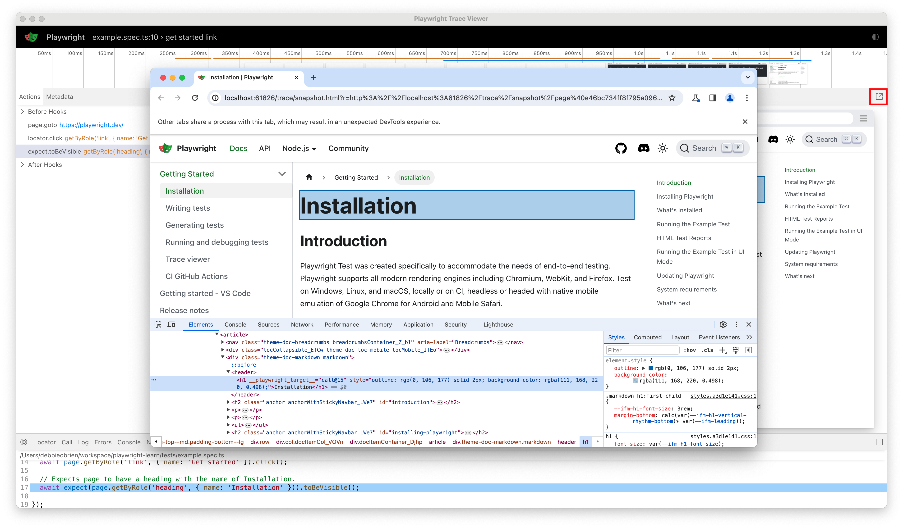
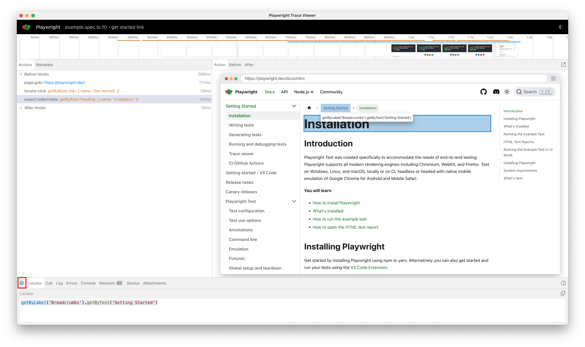
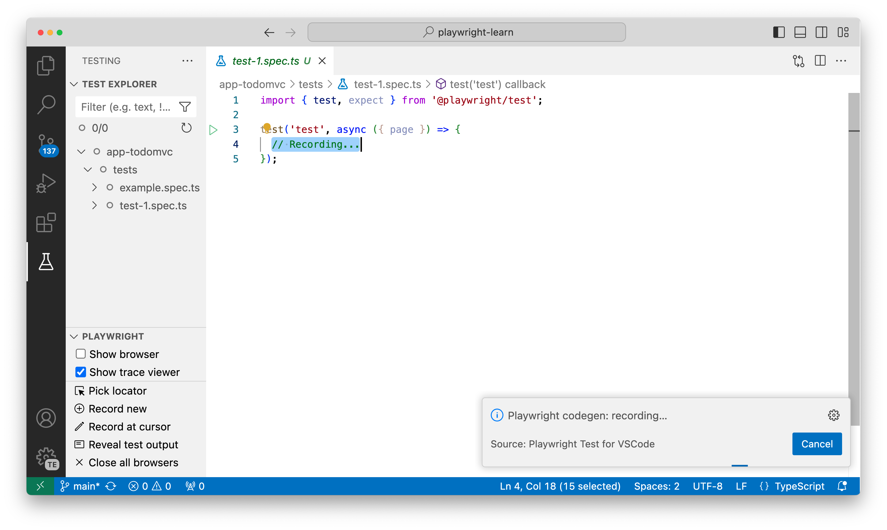
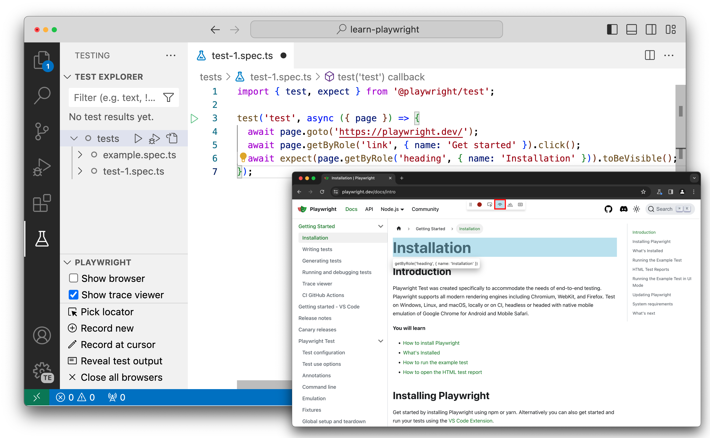

# Exercise 4: Use Visual Studio Code

In the previous section, we walked through core concepts related to the Playwright Test Configuration and Playwright Test Specification - but we used the _Playwright Commandline_ (CLI) for executing our tests and viewing reports. 

What if we could do all this _within our Visual Studio Code environment_ and have a more **visual** interaction process for authoring, running, and debugging, our tests. 

With the [Playwright Visual Studio Code Extension](https://marketplace.visualstudio.com/items?itemName=ms-playwright.playwright), you get a superior developer experience _and some unique tooling features_ that will soon make this your preferred way to interact with the Playwright Test runner. Let's jump in and take a tour.

## 4.1 Getting Started With VS Code

The [Playwright docs](https://playwright.dev/docs/getting-started-vscode) have a comprehensive tutorial with the video walkthrough below that I recommend you watch in your own time. In this lesson, we'll try to walk through a subset of these exercises to get you familiar with usage.

## 4.2 Install Playwright Extension

[Install the extension](https://marketplace.visualstudio.com/items?itemName=ms-playwright.playwright) from the VS Code Marketplace. Once installed, you should spot a beaker icon in the left-hand side of your VS Code window as shown in the screenshot. Note how the extension _automatically_ detects and gathers the test specifications in your project.

## 4.3 Run Test (Headless)

To run tests in headless manner (no browser window) make sure that _Show browser_ and _Show trace viewer_ option are unchecked. Click on the green play button on line 3 of the `example.spec.ts` file to run the first test. You can also click on the gray play buttons, in the test explorer sidebar, to run all tests in the file or to run a specific test.

Once you run your tests the `Test Results` tab in will open where you can see the entire history of test executions - and you can also drill down into a test and `Rerun Test Run` to re-run that specific test.

## 4.4 Show Browser (Headed)

If you want to run in _headed mode_ which means running your tests with a browser window open, you can toggle "Show browser" before running the tests. 

Playwright is like a very fast user which can make it difficult to keep track of what is happening in the test when using "Show browser". For debugging we recommend using the `Show trace Viewer` option.

## 4.5 Show Trace Viewer (Headed)
Select "Show trace viewer" and click on the green play button of the second test. This will launch the trace viewer window which will show you a visual representation of the test execution. 

At the top you will see a timeline of the test that you can hover over to see the state of the browser at that point in time. Click and drag to select a specific time range to focus on.

In the left sidebar you can see the actions that were performed during the test execution. If you click on the `locator.click` action you will see a red dot on the `Get Started` button in the DOM snapshot. 

Next click on the assertion, `expect.toBeVisible` and you will see our DOM snapshot has changed to show the Installation page with a highlight on the heading that we are asserting. Above the DOM snapshot you can click on the _Before_ and _After_ buttons to see the state of the DOM before and after the action was performed. 

The DOM snapshot can be popped out to a separate window by clicking on the pop out icon in the top right corner. This can be useful if you want to inspect the DOM while debugging your test.

Speaking of debugging you can also pick a locator from the DOM snapshot by clicking on the `Pick Locator` button in the bottom panel. Then hover over elements on the DOM snapshot to see the locator for that element. Clicking on it will add it to the Locator box at the bottom of the trace viewer where you can edit it before copying it to your clipboard.

Feel free to explore on your own the rest of the features of the trace viewer such as the _Call_, _Console_, _Network_, _Source_ tabs, etc.

## 4.7 Debugging Tests

For debugging we recommend running your tests with the _Show trace viewer_ option and using the trace of your tests to better understand what is happening. 

However, with the VS Code extension you can also debug your tests right in VS Code, see error messages, create breakpoints and live debug your tests. [Learn more from the docs](
https://playwright.dev/docs/getting-started-vscode#debugging-tests) or watch this video to get a sense of the debugging support.

## 4.7 Generating Tests

[CodeGen](https://playwright.dev/docs/codegen-intro) will auto generate your tests for you as you perform actions in the browser - making it the simplest way to get started for authoring tests for complex workflows. 

To generate a test click on the _Record test_ button in the testing sidebar in VS Code. This will open up a browser window where you can perform actions that will be recorded and turned into a test. You will also notice how a new file in the `tests` folder is created with the generated test.

Type in a URL in the browser window and start performing actions like a user would. You will see the actions being recorded in the test file in VS Code. 

Let's recreate the simple test we ran earlier by going to the Playwright website and clicking on the `Get Started` button. We can then select the _Assert Visibility_ icon from the Codegen toolbar and click on the `Installation` heading to assert that it is visible.

Learn more on generating tests in this video.

## 4.8 Next Steps

In this section you learned how to use the Visual Studio Code extension to find and run tests, and also how to work with the Trace Viewer to get a more visual experience for debugging tests. 

And we learned how Visual Studio Code provides richer tools for _Generating Tests_ using the `Record a New Test`, `Pick Locator`, and `Record at Cursor` features. Now - it's time to **apply** our _Playwright Fundamentals_ learnings in a guided project to build an end-to-end test specification for our sample app!
