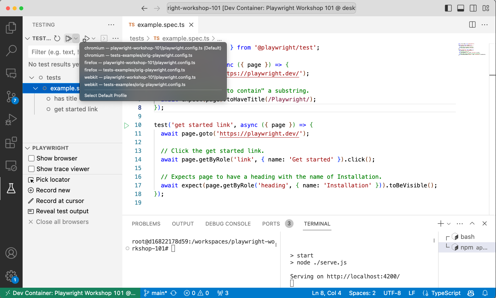
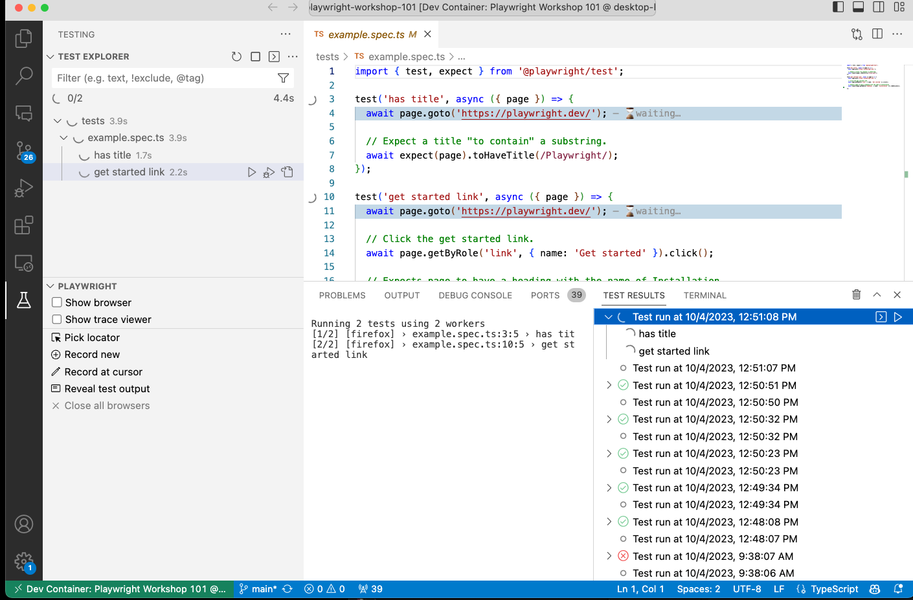

## 4.3 Run Test (Headless)

Click on the double-arrow at the top of the screen as shown below. You'll notice that Playwright has also detected and gathered _all available project configurations_ in a dropdown. Simply pick a desired configuration to run all tests. You can also go to the _Test Specification_ panel and select specific tests to run.

Click the _Reveal test output_ option to see the `Test Results` in its own tab. You can see the entire history of test executions - and you can also drill down into a test and  `Rerun Test Run` to re-run that specific test. By default, this runs tests in _headless_ mode, ideal for CI/CD and cloud testing contexts.

