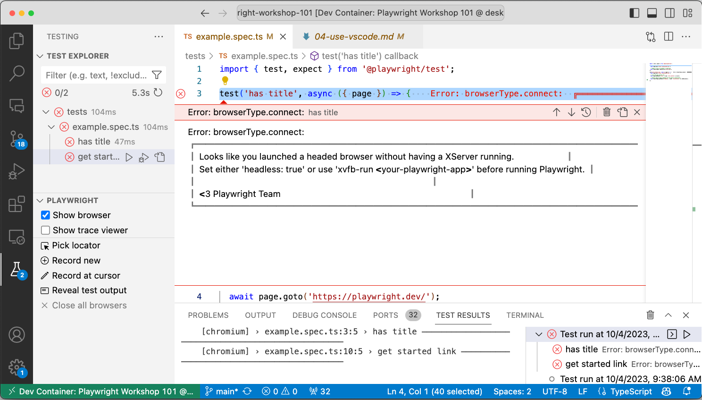
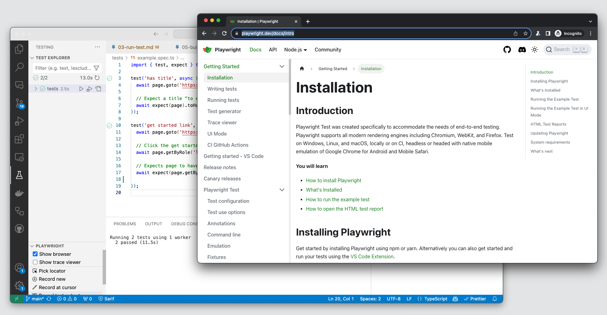
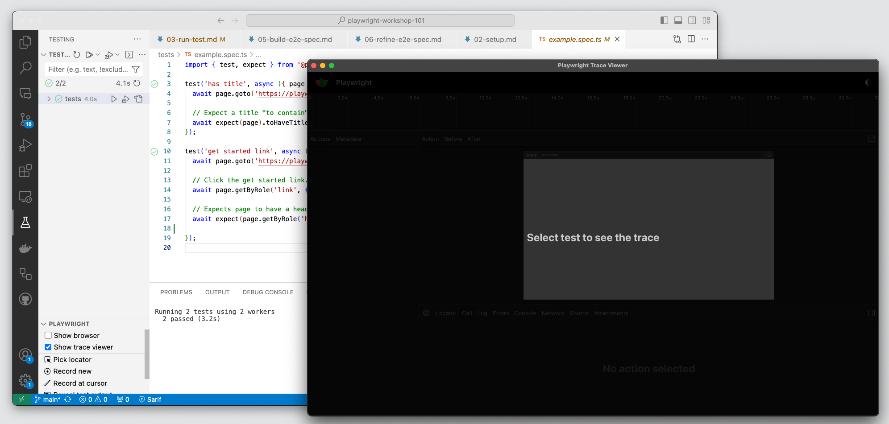
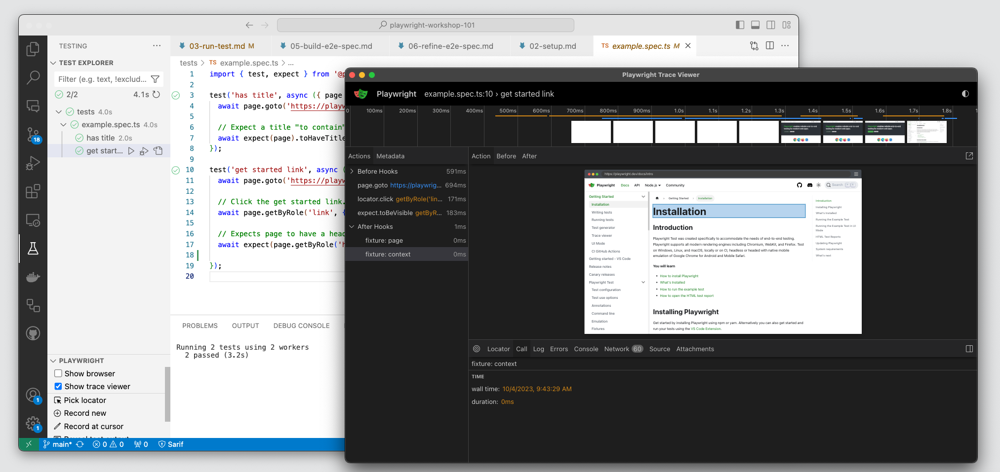

## 4.4 Show Browser (Headed)

If you want to run in _headed mode_ you can toggle "Show browser" before running the tests. This is where your experience will differ based on whether you are running in a dev container, or in your local environment.

**Running in a Dev Container**. In the screenshot below, you can see (from the green tab at bottom left) that we are running in the Dev Container when running tests - and get an error indicating we need an X server running in the container, to support this. 

**Running in Local Environment**. Open your local cloned codebase in a basic VS Code editor - note that the green tab now has no Dev Container. Now, the same action works seamlessly, launching the browser while running tests.

**Showing Trace Viewer**. In regular VS Code editor mode, you can also do other operations (like _Record tests_ or _Show Trace Viewer_) that require the launch of a separate UI window. For example, selecting "Show trace viewer" will launch the trace viewer in a separate window. 

Now you can select a specific test to run, and the Trace Viewer window will automatically update with the traces (including time-travel diagrams and performance metrics) for that test.

**But what should we do if we want to get the browser and trace viewer experiences within dev containers?* _Say hello to UI Mode_ with new support for Docker & Codespaces execution.