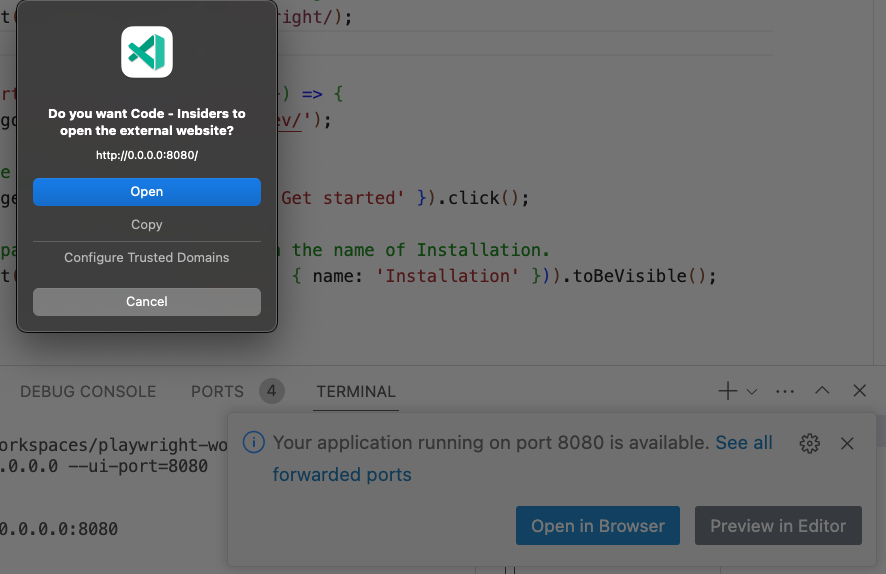
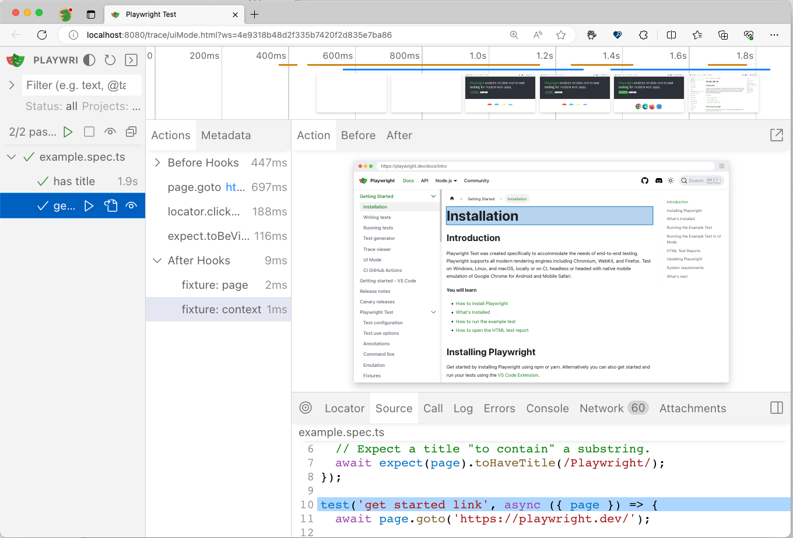
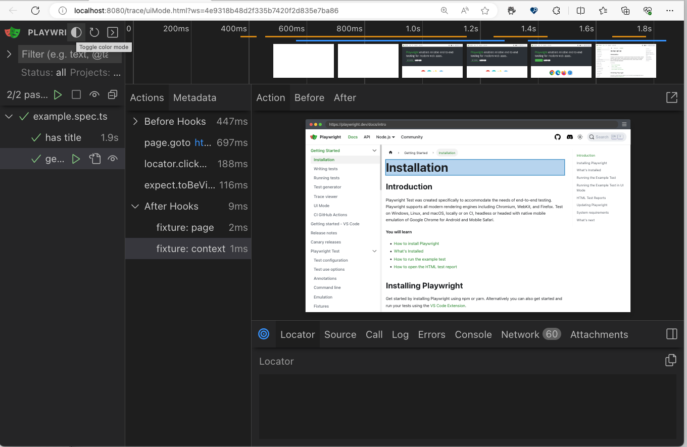

## 4.5 UI Mode (Time Travel)

Here's how UI mode is described in the [Playwright docs](https://playwright.dev/docs/test-ui-mode):

> UI Mode let's you explore, run and debug tests with a **time travel experience** complete with **watch mode**. All test files are loaded into the testing sidebar where you can expand each file and describe block to individually run, view, watch and debug each test. **Filter tests** by text or @tag or by passed, failed and skipped tests as well as by projects as set in your playwright.config file. **See a full trace** of your tests and hover back and forward over each action to see what was happening during each step and **pop out the DOM snapshot** to a separate window for a better debugging experience.

To run it in a local environment, just run your tests with the `--ui` flag. However, as shown above, this will not work within a dev container. However, the Playwright Team [introduced a workaround](https://playwright.dev/docs/test-ui-mode#docker--github-codespaces) where the endpoint needs to be bound to the `0.0.0.0` interface to become accessible on the host machine. You can also specify a hardcoded port (using `--ui-port`) if needed. Let's try it:

```bash
npx playwright test --ui-port=8080 --ui-host=0.0.0.0
```

You should see a popup like this, indicating UI mode is activated.



Click `Open` and see it launch UI Mode in your browser, in its own tab. Now you can try out all the [UI Mode Features](https://playwright.dev/docs/test-ui-mode#running-tests-in-ui-mode) from your Codespaces-deployed testing environment.



Here are a few things to try:
 - [Filter tests](https://playwright.dev/docs/test-ui-mode#filtering-tests) - by text, tag, or pass/fail/skip status.
 - [View test traces](https://playwright.dev/docs/test-ui-mode#viewing-test-traces) - opens a trace-viewer window in UI mode
 - [Pop out and inspect DOM](https://playwright.dev/docs/test-ui-mode#pop-out-and-inspect-the-dom) - for debugging with a familiar tool.
 - [Pick Locator](https://playwright.dev/docs/test-ui-mode#pick-locator) - for optimizations (e.g., save & use in tests)
 - [View Timeline](https://playwright.dev/docs/test-ui-mode#timeline-view) - time travel over the test execution timeline

You can even turn on `Dark Mode` with the toggle at top-left of the UI Mode window.!

 

But the most exciting feature here is [**Watch Mode**](https://playwright.dev/docs/test-ui-mode#watch-mode) which allows you to _track_ tests in the UI Mode scope, and automatically re-run the test on detecting changes. It's like a _live reload_ for your tests. Let's take a look at this in action.
