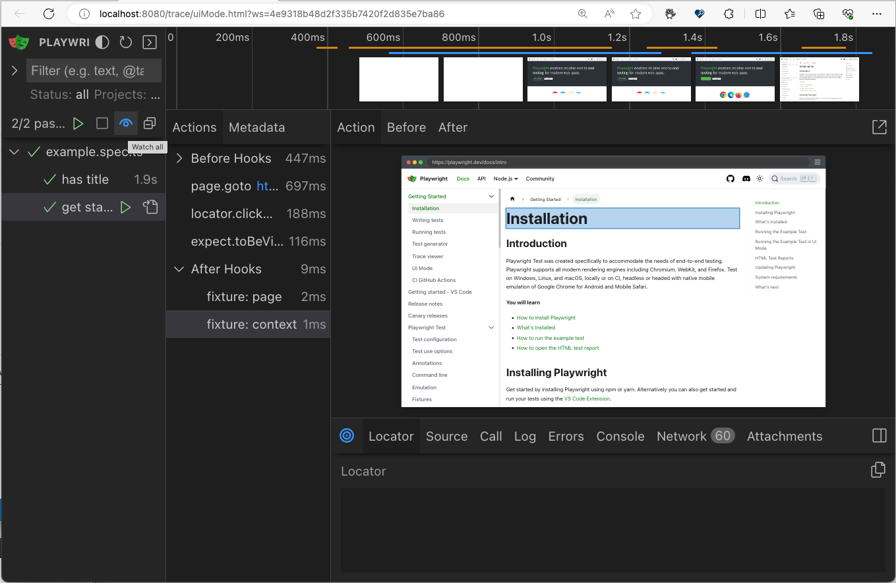
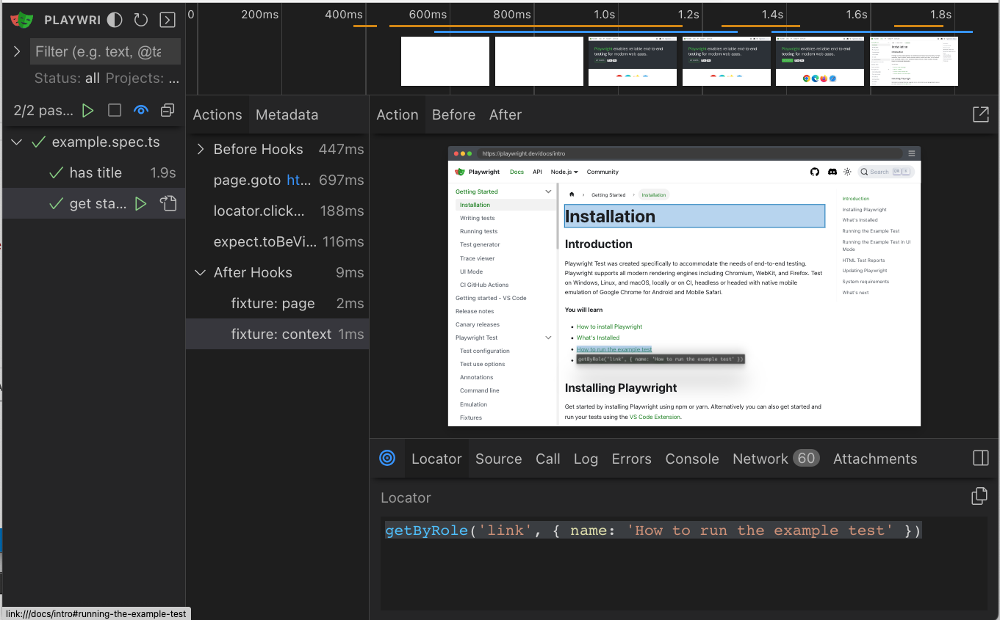
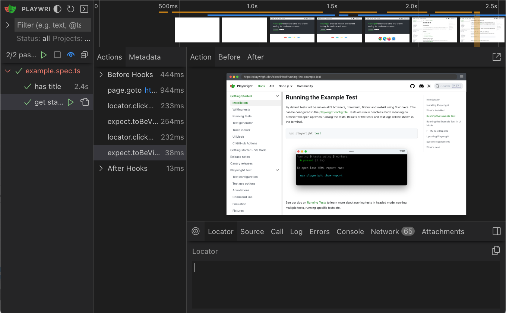

## 4.6 Watch Mode (Live Reload Tests)

Consider this scenario. Our example test specification tests the workflow of a user who:
 - visits the Playwright documentation site
 - finds the "Get Started" link and clicks it
 - visits the [correct page](https://playwright.dev/docs/intro) and starts reading.

Let's continue that scenario. The user finds that there is a link on that page titled "How to run the example test" and they click on it - to find themselves navigating to the relevant section lower down on the same page. **How do we test this and how does UI Mode with Watch help?** 

First, let's [turn on _Watch mode_](https://playwright.dev/docs/test-ui-mode#watch-mode) as shown below (see the blue eye icon with the 'Watch all' tooltip). This will now start tracking the test specification identified below it, and automatically re-run those tests if they change.



Next, let's click the [Pick Locator](https://playwright.dev/docs/test-ui-mode#pick-locator) button in blue (bottom panel) - then hover over the link that is the focus of this new user interaction scenario. 

You'll see a blue highlight around the element, and related locator information printed in the terminal area of your editor. Click the `Copy` icon to grab that information.



Now open the `example.spec.ts` file, and paste the locator information into a new action-assertion section as shown below. **Then just save the file**.

```js

test('get started link', async ({ page }) => {
  await page.goto('https://playwright.dev/');

  // Click the get started link.
  await page.getByRole('link', { name: 'Get started' }).click();

  // Expects page to have a heading with the name of Installation.
  await expect(page.getByRole('heading', { name: 'Installation' })).toBeVisible();

  // Locate the page link for "How to run the example test" and click it
  await page.getByRole('link', { name: 'How to run the example test' }).click();

  // Expect to be taken to a page that has a section
  // on "Running the Example Test in UI Mode"
  await expect(page.getByRole('heading', { name: 'Running the Example Test in UI ModeDirect link to Running the Example Test in UI Mode' })).toBeVisible();
});
```

Because watch mode is activated, this should automatically trigger the re-run of tests - and you should see the test results update in the UI Mode window. _Note how the Actions panel now shows the 2 additional actions we just added_ with no additional effort on our part.



This has the added value of allowing the developer to stay _in the flow_ in their codebase, while monitoring the UI mode window to make sure tests are passing - potentially improving developer productivity by reducing effort to context-switch or manually re-initiate test runs.

**Congratulations** You just used UI Mode with Watch!!

🛑 | We made some changes to the `example.spec.ts` for these exercises. Want to revert the changes? Just replace the modified version from a copy of the original:

```bash
cp tests-example/orig-example.spec.ts tests/example.spec.ts
```

We saved the best for last. Now, we come to the last 2 features of the VS Code Extension that will be _most_ valuable to developers: _Debugging_ and _Generating_ tests.