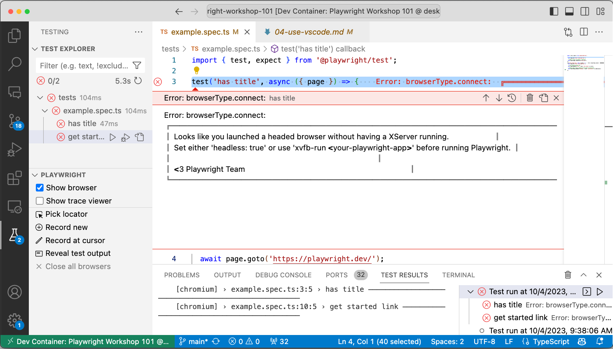
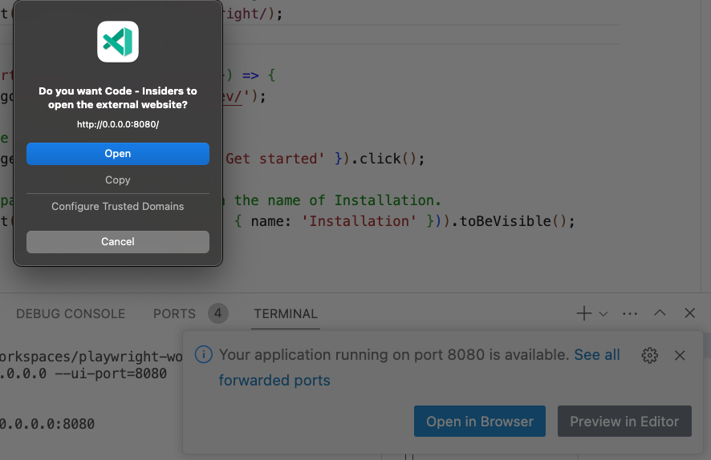

In the previous section, we walked through core concepts related to the Playwright Test Configuration and Playwright Test Specification - but we used the _Playwright Commandline_ (CLI) for executing our tests and viewing reports. 

What if we could do all this _within our Visual Studio Code environment_ and have a more **visual** interaction process for authoring, running, and debugging, our tests. 

With the [Playwright Visual Studio Code Extension](https://marketplace.visualstudio.com/items?itemName=ms-playwright.playwright), you get a superior developer experience _and some unique tooling features_ that will soon make this your preferred way to interact with the Playwright Test runner. Let's jump in and take a tour.

## 4.1 Getting Started With VS Code

The [Playwright docs](https://playwright.dev/docs/getting-started-vscode) have a comprehensive tutorial with the video walkthrough below that I recommend you watch in your own time. In this lesson, we'll try to walk through a subset of these exercises to get you familiar with usage.

[  ](https://youtu.be/Xz6lhEzgI5I)

## 4.2 Install Playwright Extension

If you are running this workshop in a dev container (e.g., GitHub Codespaces) then you're already covered!! The default `devcontainer.json` _configuration-as-code_ solution lists this extension as one of the required customizations for VS Code.

If you are running this workshop in your local environment without a dev container, then [install the extension](https://marketplace.visualstudio.com/items?itemName=ms-playwright.playwright) from the VS Code Marketplace. Once installed, you should spot a beaker icon in the left-hand side of your VS Code window as shown in the screenshot. Note how the extension _automatically_ detects and gathers the test specifications in your project.


## 4.3 Run Test (Headless)

Click on the double-arrow at the top of the screen as shown below. You'll notice that Playwright has also detected and gathered _all available project configurations_ in a dropdown. Simply pick a desired configuration to run all tests. You can also go to the _Test Specification_ panel and select specific tests to run.


Click the _Reveal test output_ option to see the `Test Results` in its own tab. You can see the entire history of test executions - and you can also drill down into a test and  `Rerun Test Run` to re-run that specific test. By default, this runs tests in _headless_ mode, ideal for CI/CD and cloud testing contexts.


## 4.4 Show Browser (Headed)

If you want to run in _headed mode_ you can toggle "Show browser" before running the tests. This is where your experience will differ based on whether you are running in a dev container, or in your local environment.

**Running in a Dev Container**. In the screenshot below, you can see (from the green tab at bottom left) that we are running in the Dev Container when running tests - and get an error indicating we need an X server running in the container, to support this. 


**Running in Local Environment**. Open your local cloned codebase in a basic VS Code editor - note that the green tab now has no Dev Container. Now, the same action works seamlessly, launching the browser while running tests.


**Showing Trace Viewer**. In regular VS Code editor mode, you can also do other operations (like _Record tests_ or _Show Trace Viewer_) that require the launch of a separate UI window. For example, selecting "Show trace viewer" will launch the trace viewer in a separate window. 


Now you can select a specific test to run, and the Trace Viewer window will automatically update with the traces (including time-travel diagrams and performance metrics) for that test.


**But what should we do if we want to get the browser and trace viewer experiences within dev containers?* _Say hello to UI Mode_ with new support for Docker & Codespaces execution.

## 4.5 UI Mode (Time Travel)

Here's how UI mode is described in the [Playwright docs](https://playwright.dev/docs/test-ui-mode):

> UI Mode let's you explore, run and debug tests with a **time travel experience** complete with **watch mode**. All test files are loaded into the testing sidebar where you can expand each file and describe block to individually run, view, watch and debug each test. **Filter tests** by text or @tag or by passed, failed and skipped tests as well as by projects as set in your playwright.config file. **See a full trace** of your tests and hover back and forward over each action to see what was happening during each step and **pop out the DOM snapshot** to a separate window for a better debugging experience.

To run it in a local environment, just run your tests with the `--ui` flag. However, as shown above, this will not work within a dev container. However, the Playwright Team [introduced a workaround](https://playwright.dev/docs/test-ui-mode#docker--github-codespaces) where the endpoint needs to be bound to the `0.0.0.0` interface to become accessible on the host machine. You can also specify a hardcoded port (using `--ui-port`) if needed. Let's try it:

```bash
npx playwright test --ui-port=8080 --ui-host=0.0.0.0
```

You should see a popup like this, indicating UI mode is activated.



Click `Open` and see it launch UI Mode in your browser, in its own tab. Now you can try out all the [UI Mode Features](https://playwright.dev/docs/test-ui-mode#running-tests-in-ui-mode) from your Codespaces-deployed testing environment.


Here are a few things to try:
 - [Filter tests](https://playwright.dev/docs/test-ui-mode#filtering-tests) - by text, tag, or pass/fail/skip status.
 - [View test traces](https://playwright.dev/docs/test-ui-mode#viewing-test-traces) - opens a trace-viewer window in UI mode
 - [Pop out and inspect DOM](https://playwright.dev/docs/test-ui-mode#pop-out-and-inspect-the-dom) - for debugging with a familiar tool.
 - [Pick Locator](https://playwright.dev/docs/test-ui-mode#pick-locator) - for optimizations (e.g., save & use in tests)
 - [View Timeline](https://playwright.dev/docs/test-ui-mode#timeline-view) - time travel over the test execution timeline

You can even turn on `Dark Mode` with the toggle at top-left of the UI Mode window.!

 

But the most exciting feature here is [**Watch Mode**](https://playwright.dev/docs/test-ui-mode#watch-mode) which allows you to _track_ tests in the UI Mode scope, and automatically re-run the test on detecting changes. It's like a _live reload_ for your tests. Let's take a look at this in action.

## 4.6 Watch Mode (Live Reload Tests)

Consider this scenario. Our example test specification tests the workflow of a user who:
 - visits the Playwright documentation site
 - finds the "Get Started" link and clicks it
 - visits the [correct page](https://playwright.dev/docs/intro) and starts reading.

Let's continue that scenario. The user finds that there is a link on that page titled "How to run the example test" and they click on it - to find themselves navigating to the relevant section lower down on the same page. **How do we test this and how does UI Mode with Watch help?** 

First, let's [turn on _Watch mode_](https://playwright.dev/docs/test-ui-mode#watch-mode) as shown below (see the blue eye icon with the 'Watch all' tooltip). This will now start tracking the test specification identified below it, and automatically re-run those tests if they change.


Next, let's click the [Pick Locator](https://playwright.dev/docs/test-ui-mode#pick-locator) button in blue (bottom panel) - then hover over the link that is the focus of this new user interaction scenario. 

You'll see a blue highlight around the element, and related locator information printed in the terminal area of your editor. Click the `Copy` icon to grab that information.


Now open the `example.spec.ts` file, and paste the locator information into a new action-assertion section as shown below. **Then just save the file**.

```js

test('get started link', async ({ page }) => {
  await page.goto('https://playwright.dev/');

  // Click the get started link.
  await page.getByRole('link', { name: 'Get started' }).click();

  // Expects page to have a heading with the name of Installation.
  await expect(page.getByRole('heading', { name: 'Installation' })).toBeVisible();

  // Locate the page link for "How to run the example test" and click it
  await page.getByRole('link', { name: 'How to run the example test' }).click();

  // Expect to be taken to a page that has a section
  // on "Running the Example Test in UI Mode"
  await expect(page.getByRole('heading', { name: 'Running the Example Test in UI ModeDirect link to Running the Example Test in UI Mode' })).toBeVisible();
});
```

Because watch mode is activated, this should automatically trigger the re-run of tests - and you should see the test results update in the UI Mode window. _Note how the Actions panel now shows the 2 additional actions we just added_ with no additional effort on our part.


This has the added value of allowing the developer to stay _in the flow_ in their codebase, while monitoring the UI mode window to make sure tests are passing - potentially improving developer productivity by reducing effort to context-switch or manually re-initiate test runs.

**Congratulations** You just used UI Mode with Watch!!

🛑 | We made some changes to the `example.spec.ts` for these exercises. Want to revert the changes? Just replace the modified version from a copy of the original:

```bash
cp tests-example/orig-example.spec.ts tests/example.spec.ts
```

We saved the best for last. Now, we come to the last 2 features of the VS Code Extension that will be _most_ valuable to developers: _Debugging_ and _Generating_ tests.

## 4.7 Debugging Tests

With the VS Code extension you can debug your tests right in VS Code see error messages, create breakpoints and live debug your tests. [Learn more from the docs](
https://playwright.dev/docs/getting-started-vscode#debugging-tests) or watch this video to get a sense of the debugging support. _This is best demonstrated when in the guided project coming up later_. For now, get a quick overview of the debugging support in this video.

[  ](https://youtu.be/LM4yqrOzmFE)

## 4.7 Generating Tests

[CodeGen](https://playwright.dev/docs/codegen-intro) will auto generate your tests for you as you perform actions in the browser - making it the simplest way to get started authoring tests for complex workflows. The Codegen support in VS Code is more feature-rich than from command-line, and is easier to use given we are already in an editor environment. _This is also best demonstrated when in the guided project coming up later_. For now, get a quick overview of the debugging support in this video.

[  ](https://youtu.be/tJF7UhA59Gc)

## 4.8 Next Steps

In this section you learned how to use the Visual Studio Code extension to find and run tests, and also how to use UI Mode to get a more visual experience for debugging tests, and how to use Watch Mode to get a live reload experience for seamless test-driven development. 

And we learned how Visual Studio Code provides richer tools for _Generating Tests_ using the `Record a New Test`, `Pick Locator`, and `Record at Cursor` features. Now - it's time to **apply** our _Playwright Fundamentals_ learnings in a guided project to build an end-to-end test specification for our sample app!
